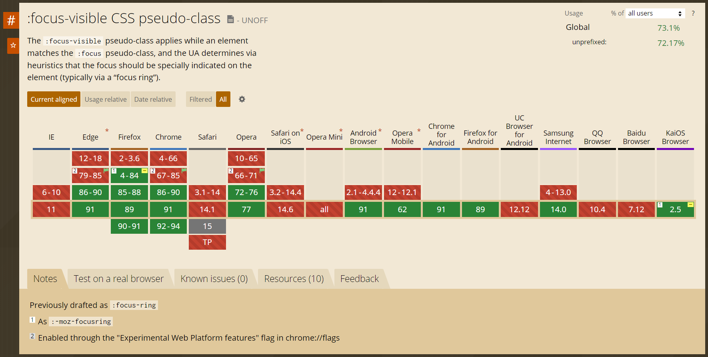

# Focus, Focus-within, Focus-visible

* Focus เองแล้วเปลี่ยน ใช้ `:focus`
* Children focus แล้วต้องเปลี่ยน ใช้ `:focus-within`
* อยากให้ focus ตอนเฉพาะใช้ keyboard เท่านั้น \(เพื่อทำ a11y\) ใช้ `:focus-visible`

