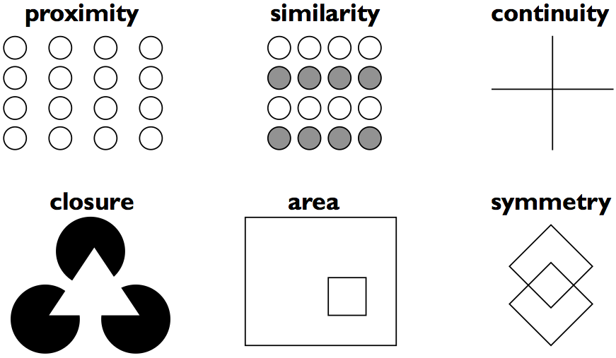
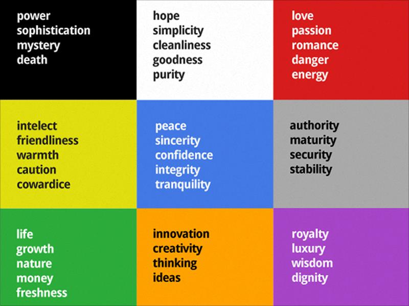

# \[HCI10] Gestalt Theory and Use of Colors

## Gestalt Theory

เป็นทฤษฎีที่อธิบายว่าเรามองภาพเล็กๆ ขึ้นไปเป็นกลุ่มใหญ่อย่างไร โดยมีอยู่ 6 ข้อคือ:

1. **Proximity:** ของใกล้กันดูเป็นของกลุ่มเดียวกันมากกว่า
2. **Similarity:** ของคล้ายๆ กันจะดูเหมือนอยู่กลุ่มเดียวกันมากกว่า
3. **Continuity:** คนเรามองเส้นเป็นสิ่งที่ต่อเนื่องกัน
4. **Closure:** ถึงแม้ว่าเส้นจะขาดหาย หรือภาพไม่ได้ต่อสมบูรณ์กันนัก คนเราก็จะพยายามต่อเส้นในสมองเพื่อให้เห็นภาพชัดเจนขึ้น
5. **Area:** เวลาที่มีของวางซ้อนกัน คนจะมองว่าของที่เล็กกว่าจะวางอยู่ข้างหน้า
6. **Symmetry:** ตาเราชอบของที่เป็นสมมาตรกันมากกว่า เพราะมันสร้าง Mental Model ง่าย

## Color Theory

สีนั้นเป็นปัจจัยหนึ่งที่ส่งผลต่อการรับรู้ของคนเราเป็นอย่างมาก เราจึงควรใช้สีที่สื่อความหมายหรือแสดงอารมณ์ต่อ product ของเรา ซึ่งวิธีใช้สีก็มีหลายแบบ เช่น

1. ใช้สีเดียวกันทั้งหมด
2. ใช้สีคู่ตรงข้าม
3. ใช้สีที่สื่อถึงสิ่งๆ นั้น

โดยในการใช้สีนั้น มีหลักการพื้นฐานคือ:

1. ไม่ควรใช้สีมากเกินไปในงานออกแบบ
2. ใช้หลักการ 60:30:10 คือใช้สีหลัก 60% ของตัวงาน ใช้สีรอง 30% ของตัวงาน และสีที่ใช้เน้นความสำคัญ 10%
