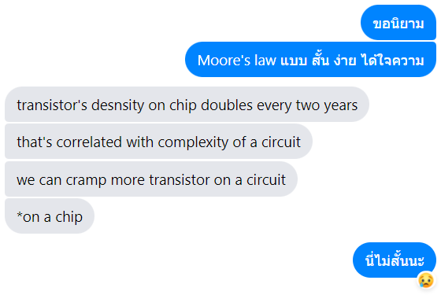

# \[HCI2] Computer

รอบที่แล้วเราพูดเกี่ยวกับเรื่องคนไปว่าเรามีอะไรหรือปัจจัยอะไรที่ส่งผลต่อการกระทำของเรา วันนี้เราก็มาในหัวข้อที่เกี่ยวข้องกับวิชานี้ก็คือ "คอมพิวเตอร์" นั่นเองงง

เวลาเราพูดถึง Interaction ในแง่ของคอมพิวเตอร์แล้ว มันคือสิ่งที่ทำให้ข้อมูลไหลจากคนเข้าสู่/ออกจากคอมพิวเตอร์ได้ ซึ่งก็คือ Input Output นั่นเอง

ดังนั้นในบทนี้ เราจะมาพูดถึง Input Output รวมทั้งปัจจัยต่างๆ ของคอมพิวเตอร์กัน โก!

## Input

Input ก็คือ สิ่งที่ทำให้ข้อมูลจากคนไหลเข้าคอมได้ แน่นอนว่าก็มี input หลักคล้ายๆ กับที่เราเรียนกันมาตั้งแต่เด็กแล้วก็คือ

* **ข้อความ (Text):** หลักๆ ก็คือคีย์บอร์ด ไม่ว่าจะเป็นคีย์บอร์ดธรรมดา, [Stenotype](https://en.wikipedia.org/wiki/Stenotype), ใช้ Touchscreen หรือถ้าไม่ใช้คีย์บอร์ด จะใช้ไมค์โครโฟนทำ Speech recognition ก็ได้ หรือใช้ Handwriting recognition ก็ได้
* **ชี้/บอกตำแหน่ง (Pointing/Positioning):** ใช้เมาส์ ทัชแพด เมาส์ปากกา หรือเดี๋ยวนี้จะโม eye tracking device มาเป็น pointing device ก็ได้
* **ภาพ (Image):** ใช้กล้อง
* **เสียง (Sound):** ใช้ไมค์โครโฟน จะอัดเสียง อัดเพลง อะไรก็ว่าไป
* อื่นๆ เช่น MIDI Input หรือพวก Sensor ต่างๆ ที่ต่อได้ผ่านทาง USB เป็นต้น

## Output

หลังจากเอาข้อมูลไหลเข้าคอมได้แล้ว คราวนี้มาดูว่าอะไรทำให้ข้อมูลไหลออกจากคอมบ้าง

* **ข้อความ (Text):** หลักๆ เราอ่านข้อความจากจอภาพเนอะ หรือจะใช้เครื่องพิมพ์ก็ได้ อีกวิธีที่ทำได้ที่คนตาบอดใช้ก็คือใช้เครื่อง [Braille display](https://en.wikipedia.org/wiki/Refreshable\_braille\_display) แสดงตัวอักษรเบรลล์ออกมาเพื่อให้คนใช้นิ้วอ่านได้
* **ชี้/บอกตำแหน่ง (Pointing/Positioning):** ก็ใช้จอนี่แหละ
* **ภาพ (Image):** ก็ยังใช้จออยู่... อ้อ ใช้โปรเจกเตอร์ก็ได้นะ
* **เสียง (Sound):** ใช้ลำโพง
* อื่นๆ เช่น จอยสติ๊กสั่นเวลาโดนดาเมจ เป็นต้น

## Memory & Processors

Memory หลักๆ ก็มี 2 แบบ

* **Short Term:** RAM
* **Long Term:** HDD, SSD, หรือจะบันทึกลง Floppy disc, CD, DVD, Blu-ray ก็ได้ ถ้ายังใช้กันอยู่

โดยทั้ง Memory และ Processor นั้น แน่นอนว่ามี Speed และ Capacity ที่จำกัด (แต่ถ้าเรารวย เราจะใช้เงินแก้ปัญหาได้ 🤑)

## Moore's Law

ถึงจะมีคำว่า Law อยู่ในชื่อ แต่จริงๆ แล้ว Moore's Law เป็นการสังเกตและคาดคะเนโดยคุณ Gordon Moore ว่าจำนวน Transistors ในชิป IC เนี่ย มันจะเพิ่มขึ้น 2 เท่า ทุกๆ 2 ปี ([วิกิ](https://en.wikipedia.org/wiki/Moore's\_law))

ซึ่งจริงๆ ก็ไม่ผิด เพราะ Trend ใน_ตอนนั้น_มันเป็นแบบนั้นจริงๆ แต่เอาเข้าจริงๆ ในปัจจุบันก็เริ่มมีบทความออกมาแล้วว่าตอนนี้เราทำชิปที่ transistors มันเล็กม๊ากมากจนมันแทบจะไปต่อไม่ได้แล้ว พูดง่ายๆ คือ เวลตัน

ขอ quote จาก[บทความนี้](https://builtin.com/hardware/moores-law)มาแบบไม่แก้อะไรเลยนะ แต่ point ตรงไปตรงมามาก

> As we continue to miniaturize chips, we’ll no doubt  bump into [Heisenberg’s uncertainty principle](https://en.wikipedia.org/wiki/Uncertainty\_principle), which limits precision at the quantum level, thus limiting our computational capabilities. [James R. Powell calculated](https://ieeexplore.ieee.org/document/4567410) that, due to the uncertainty principle alone, Moore’s Law will be obsolete by 2036.

ก็คือ เราทำชิปให้มันเล็กลงๆ จนจะเข้าโลกควอนตัมแล้ว ซึ่งฟิสิกส์ในโลกควอนตัมมันไม่เหมือนกับฟิสิกส์ในโลกคนยักษ์ได้ ทำให้ความแม่นยำลดลง และทำให้ความพยายามที่เราจะทำคอมแรงๆ มันตันอ่ะนะ แน่นอนว่าในอนาคต Moore's Law (ซึ่งจริงๆ ก็ไม่ใช่ Law) ก็อาจจะไม่ relevant อีกแล้ว


ไหนๆ ก็ไหนๆ แล้ว ขายของตรงนี้เลยละกัน

ฝากติดตามซีรีส์ [Quantum Programming and Computing](../quantum/) ด้วยจ้า เดี๋ยวจะกลับไปเขียนเร็วๆ นี้แหละ


อ่านๆ มาแล้ว Human Computer Interaction ก็ดูเหมือนจะไม่ได้เกี่ยวข้องอะไรเลยกับ Moore's Law แต่จริงๆ แล้วมันคือการบอกว่าคอมพิวเตอร์เรามีลิมิตในตัวของมันเอง การออกแบบ interaction ต่างๆ ก็ควรคำนึงถึงเรื่องพวกนี้ด้วย ไม่ต่างจากการคำนึงถึงคนที่ใช้ด้วย (จะได้ไม่ดูกระตุก)

## Other Devices

แอบขยายโดเมนของหัวข้อนี้เพิ่มเติมสักหน่อย ในอุปกรณ์อื่นๆ ในชีวิตเรา เราก็มักจะเจอ Input Output หรือ Interface ต่างๆ อยู่มากมาย เช่น

* **เครื่องซักผ้า:** เรามี Input เป็นปุ่มหมุนเป็น หรือถ้าเป็นแบบดิจิตอลเราก็จะใช้การกดปุ่ม ซึ่งก็จะมี Interface เป็นเวลาดิจิตอล ส่วน Output ก็คือการที่เราได้การปั่นผ้านี่แหละ
* **ไมโครเวฟ:** เรามี Input เป็นปุ่มหมุนหรือปุ่มกดเวลาคล้ายๆ เครื่องซักผ้า แล้วเราได้คลื่นไมโครเวฟเป็น Output

จะเห็นได้ว่า ไม่ใช่แค่คอมพิวเตอร์เท่านั้นที่มี Input Output แต่สิ่งรอบๆ ตัวเราล้วนมี Input Output หมดเลย ซึ่งการออกแบบ Interaction ก็จะช่วยให้คนที่ใช้สามารถถ่ายทอดข้อมูลหรือความต้องการต่ออุปกรณ์นั้นๆ ได้ถูกต้อง แม่นยำ
