# \[HCI3] Interaction

Interaction คือ การถ่ายโอนข้อมูล (Information Transfer)

## Term of Interactions

* **Domain:** บริเวณที่เราทำการศึกษา
* **Goal:** สิ่งที่เราต้องการ
* **Task:** สิ่งที่ต้องทำเพื่อบรรลุ Goal

## Donald Norman's Model

มีด้วยกัน 7 ข้อ คือ

1. User establishes the goal — ผู้ใช้คิดว่าต้องการอะไร
2. Formulates intention — สร้างแผนการ
3. Specifies actions at interface — หาว่าอยู่ตรงไหน
4. Executes action — ทำตามแผน
5. Perceives system state — ดูสิ่งที่เปลี่ยนไป
6. Interprets system state — ทำความเข้าใจกับสิ่งที่เปลี่ยนไป
7. Evaluates system state with respect to goal — ดูว่าสิ่งที่เปลี่ยนไปเป็นไปตามที่เราต้องการไหม

7 ข้อนี้จะพูดถึงสิ่งที่ User ทำเมื่อต้องการที่จะ interact กับระบบใดระบบหนึ่ง โดยทั้ง 7 ข้อจะถูกแบ่งออกไป 3 ส่วนคือ

1. ส่วนของ Goal: ข้อ 1
2. ส่วนของ Execution (เรียกว่า Gulf of Execution): ข้อ 2 - 4
3. ส่วนของ Evaluation (เรียกว่า Gulf of Evaluation): ข้อ 5 - 7

โดยจะสามารถเขียนออกมาเป็นแผนภาพได้ดังนี้ (เรียกว่า Execution/Evaluation Loop)

ข้อทั้ง 7 นี้ มีข้อที่น่าสังเกตอยู่ 2 ข้อ คือ ข้อ 3 และ 5

* **ข้อ 3** จะตั้งอยู่บนสมมติฐานของผู้ใช้ว่า ระบบนี้สามารถทำได้ เมื่อผู้ใช้ทำข้อ 4 แล้วทำไม่ได้ ผู้ใช้ก็จะสตั๊น
* **ข้อ 5** จะตั้งอยู่บนความคาดหวังของผู้ใช้ว่า ระบบจะมีการเปลี่ยนแปลง หากระบบไม่มีการเปลี่ยนแปลง ผู้ใช้ก็จะสตั๊น

## Ergonomic

* พูดถึง physical characteristics ของ interaction (พูดอีกอย่างคือ Human Factor)
* เพราะมนุษย์มีข้อจำกัด ทำยังไงให้เราสามารถสื่อสารการใช้งานได้ตรงเป้าที่สุด
