# \[HCI4] The Basics of Interaction Design

## Interaction Design คือ?

* Interaction Design คือการออกแบบ**การโต้ตอบ** ไม่ใช่หน้าตา เพื่อให้บรรลุวัตถุประสงค์ที่ต้องการ
* ออกแบบ flow ทั้งหมดว่ามันมารวมกันได้ยังไง

## Design คือ?

* Design คือ การออกแบบที่ทำให้**บรรลุเป้าหมาย ภายใต้ข้อจำกัด**
* ซึ่งถ้าจะทำให้ได้ตามข้อข้างบน เราต้อง **trade off ระหว่างสิ่งที่อยากได้กับความเป็นจริง**

## Personas & Scenarios

* **Personas** คือ รายละเอียดของตัวแทนบุคคลที่มาใช้ระบบ
* ใช้เพื่อสร้างความเข้าใจกับตัวงานว่า คนที่ใช้นั้นจะมีแนวคิด หรือการกระทำอย่างไรต่อตัวงาน
* **Scenarios** คือ การวางเหตุการณ์เพื่อดูว่าผู้ใช้ทำอะไรเพื่อบรรลุวัตถุประสงค์
* Scenarios ควรตอบคำถามว่า:
  * User เห็นอะไร?
  * User ทำอะไร?
  * User คิดอะไร?

## Navigation Design

ในการออกแบบในส่วนของตัวนำทางหรือ Navigation นั้น ควรมีหลักในการออกแบบดังนี้

1. ผู้ใช้ควรรู้ว่าตอนนี้อยู่ตรงไหน
2. ผู้ใช้ควรรู้ว่า Navigation ทำอะไรได้
3. ผู้ใช้ควรรู้ว่าเมื่อกดแล้วจะไปไหน หรือจะเกิดอะไร
4. ผู้ใช้ควรรู้ว่าก่อนหน้านั้นอยู่ไหนหรือทำอะไรอยู่

## Diagrams

Diagram ต่างๆ ที่เรามักจะพบเห็นได้ในงาน Design จะมีอยู่ 2 ประเภท คือ

1. Hierarchical Diagram: เป็นการแสดงหน้าต่างๆ ของตัวเว็บหรือแอปพลิเคชัน
2. Network Diagram: เป็นการแสดงเส้นทางต่างๆ ของระบบที่ผู้ใช้สามารถทำได้

## Interaction Design Process

ในการออกแบบ Interaction นั้น มีสิ่งที่ต้องทำที่สำคัญอยู่ 4 อย่างก็คือ

* ต้องมีความต้องการที่ตั้งขึ้นมาชัดเจน (Establish Requirements)
* ออกแบบมาให้หลากหลาย (Design Alternatives)
* มีการทำ Prototype (Prototyping)
* มีการทดสอบ Design (Evaluating)
