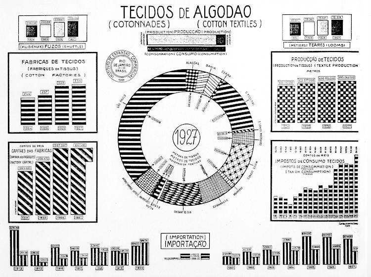

# \[HCI9] Representations and Information Visualization

## Representation

Representation เป็นการเอาข้อมูลมาแสดงผลตาม**ความหมาย**ของข้อมูลนั้นๆ เพื่อใช้ในการวิเคราะห์หรือใช้ตามวัตถุประสงค์ของข้อมูล โดยอาจจะทำให้มันอ่านหรือทำความเข้าใจได้ง่ายขึ้นกว่าเดิมจากข้อมูลดิบ โดย Representation ที่ดี ควร:

* แสดงให้เห็นสิ่งที่สำคัญและลดทอนสิ่งที่ไม่จำเป็น
* เหมาะสมกับบุคคลและงานที่ใช้ เพื่อนำไปสู่บทสรุปที่ได้จากข้อมูล

## Information Visualization

เป็นการนำข้อมูลมาแสดงผลที่:

* แสดงให้เห็นข้อมูล (Show the Data)
* ไม่บดบังสิ่งที่ต้องการนำเสนอ (Not Get in the Way of the Message)
* ไม่ควรมีการยืดหรือบิดผลลัพธ์ (Avoid Distortion)
* แสดงจำนวนหลายๆ จำนวนในพื้นที่เล็กๆ (Present Many Numbers in a Small Space)
* สร้างการเชื่อมโยงข้อมูลหลายๆ ชุด (Make Large Data Sets Coherent)
* ช่วยให้เราอยากเปรียบเทียบ (Encourage Comparison Between Data)
* ช่วยให้เห็นทั้งภาพมุมกว้างและรายละเอียดภายใน (Supply Both a Broad Overview and Fine Detail)
* มีจุดประสงค์ที่แน่นอน (Serve a Clear Purpose)

## Chart Junk

เป็นการทำให้ chart นั้นมีความเว่อวังจนทำให้คนหลุดโฟกัสจากเนื้อหาที่ต้องการสื่อจริงๆ ส่วนใหญ่มักจะพลาดตรงที่เราพยายามทำให้มันสวยงามแต่เราลืม purpose ของมันไป

