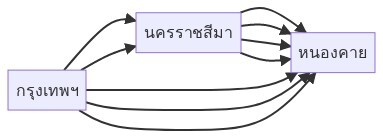

# \[STA2\] Fundamental Counting Principle

โจทย์ความน่าจะเป็นหลายๆ ข้อที่เราเจอกันมาตั้งแต่มัธยมฯ จะชอบถามเราว่า "สรุปแล้วสิ่งที่เกิดขึ้น \(จากเหตุการณ์ที่กำหนด\) มีทั้งหมดเท่าไร?" แน่นอนว่า ถ้าเราอยากจะรู้ว่าโจทย์ที่กำหนดมาจะก่อให้เกิดผลลัพธ์กี่แบบ เราก็ต้องเรียนรู้สิ่งที่เรียกว่า "**กฎการนับเบื้องต้น \(Fundamental Counting Principle\)**" กันก่อน

ซึ่งจริงๆ เจ้ากฎตัวนี้เราก็เรียนกันมาหมดแล้วแหละ คือประกอบไปด้วยกฎพื้นฐาน 2 ตัวคือ:

1. กฎการคูณ \(Rule of Product\)
2. กฎการบวก \(Rule of Sum\)

เดี๋ยวเราไปเริ่มกันที่กฎแรกกันก่อนเลยดีกว่า นั่นก็คือ…

## กฎการคูณ \(Rule of Product\)


**ทฤษฎี:** ถ้าการดำเนินการมี $$k$$ ขั้นตอน ขั้นตอนที่หนึ่งทำได้ $$n_1$$ วิธี ในแต่ละวิธี ทำขั้นตอนที่สองได้ $$n_2$$ วิธี … ดังนี้ไปเรื่อยๆ จนถึงขั้นตอนที่ $$k$$ ซึ่งทำได้ $$n_k$$ วิธี เพราะฉะนั้น การดำเนินการ $$k$$ อย่างนี้ต่อเนื่องกัน จะมีวิธีทำได้ถึง $$n_1\times n_2\times n_3\times\dots\times n_k$$ วิธี


กฎการคูณจะพูดถึงการกระทำบางอย่างเป็นขั้นตอนแล้ว**ยังทำขั้นตอนไม่เสร็จ** ซึ่งโจทย์ส่วนใหญ่ที่จะใช้จะถามอยู่ในลักษณะ:

* ทำ X, Y ครั้ง \(ทำซ้ำ\)
* มี X มี Y จะทำ X แล้ว Y ได้กี่วิธี \(ลำดับ\)
* เอาของ X อย่าง, มาประกอบเป็น Y \(ประกอบ\)

เดี๋ยวเรามาลองดูตัวอย่างโจทย์กันดีกว่า


**ปัญหา 1:** ในการโยนเหรียญบาท 3 ครั้ง จะเกิดผลลัพธ์ต่างๆ กันกี่อย่าง?


โจทย์ข้อนี้จะเห็นว่าเป็นโจทย์ลักษณะแบบการทำซ้ำ คือโยนเหรียญไปเรื่อยจนกว่าจะครบ 3 ครั้ง

พอเราโยนเหรียญไป 1 ครั้ง ผลลัพธ์ที่เกิดขึ้นคือ "หัว" กับ "ก้อย" แต่สิ่งที่โจทย์อยากได้คือ_โยน 3 ครั้ง_ แสดงว่าเรายัง**ทำไม่เสร็จ** ต้องโยนเพิ่มอีก 2 ครั้ง

ทีนี้ ถ้าเราทดลองไล่ Sample Space ดู เราจะพบว่าการโยนเหรียญบาท 3 ครั้งจะทำให้เกิดผลลัพธ์ดังนี้

$$
S=\{HHH,HHT,HTH,HTT,THH,THT,TTH,TTT\}
$$

เมื่อกำหนดให้ H คือหัว T คือก้อย

เราจะเห็นว่า จำนวนสมาชิกใน Sample Space จะเกิดจากจำนวนผลลัพธ์จากการโยนในแต่ละครั้ง_คูณ_กัน นั้นคือ

$$
\begin{aligned}
|S_1|\times|S_2|\times|S_3|=&\,|S|\\
|\{H,T\}|\times|\{H,T\}|\times|\{H,T\}|=&\,|\{HHH,HHT,\dots,TTT\}|\\
2\times2\times2=&\,8
\end{aligned}
$$

**ดังนั้น:** ในการโยนเหรียญบาท 3 ครั้ง จะเกิดผลลัพธ์ต่างๆ กัน 8 อย่าง


**หมายเหตุ:**

* สัญลักษณ์ $$|X|$$ \(เมื่อ $$X$$ เป็นเซต\) คือจำนวนสมาชิกของเซต $$X$$
* $$S_1,S_2,S_3$$ คือเซตของผลลัพธ์จากการกระทำในแต่ละครั้ง \("การกระทำ" ในที่นี้คือการโยนเหรียญนั่นเอง\)


น่าจะพอเริ่มเห็นภาพลางๆ ละ เดี๋ยวไปดูโจทย์เพิ่มเติมในลักษณะอื่นๆ กันดีกว่า


**ปัญหา 2:** ห้องหนึ่งมีทางเข้า 2 ทาง และทางออก 3 ทาง \(ทางเข้าห้ามออกและทางออกห้ามเข้า\) จะมีวิธีที่จะผ่านเข้าและออกจากห้องนี้ได้กี่วิธี?


คราวนี้ จะเห็นว่าโจทย์ข้อนี้มีลักษณะเป็นแบบลำดับ มีเข้าแล้วก็ต้องออก และห้ามออกทางเข้าด้วย 😂

ถ้าเราลองจินตนาการดูตอนเราเข้า เราก็จะเลือกทางเข้าได้ 2 ประตู พอเราเข้าไปแล้ว เราก็จะโดนบังคับออก \(เพราะยังไม่เสร็จ\) แต่ไม่ว่าจะเข้าประตูไหน ก็ออกได้ 3 ประตูอยู่ดี ทำให้จำนวนวิธีที่เราจะเข้าออกห้องนี้เป็น $$|\{เข้า\ 1,เข้า\ 2\}|\times|\{ออก\ 1,ออก\ 2,ออก\ 3\}|=2\times3=6$$ วิธี

**ดังนั้น:** เราจะผ่านเข้าและออกจากห้องนี้ได้ 6 วิธีนั่นเอง

เราไปดูโจทย์ในลักษณะสุดท้ายกันเลยดีกว่า


**ปัญหา 3:** จากเลขโดด 1, 2, 3, …, 9 จะนำมาสร้างจำนวนเลขสองหลักได้กี่จำนวน เมื่อ:

1. เลขทั้งสองหลักซ้ำกันได้
2. เลขทั้งสองหลักห้ามซ้ำกัน


จากโจทย์ข้อนี้มันจะเป็นลักษณะของการประกอบ คือเอาเลข 1 - 9 มาประกอบกันเป็นเลข 2 หลัก ทั้งแบบหลักซ้ำและไม่ซ้ำ เรามาพิจารณากันทีละข้อย่อยเลยดีกว่า 😄

**ข้อย่อย 1.** เลขทั้งสองหลักซ้ำกันได้

ถ้าสมมติว่าโจทย์มีแค่เลข 1 กับ 2 คำตอบที่จะได้คือ $$|\{1,2\}|\times|\{1,2\}|=2\times2=4$$ จำนวน

แล้วถ้ามีเลข 1, 2, 3 ล่ะ? ก็จะได้ $$|\{1,2,3\}|\times|\{1,2,3\}|=3\times3=9$$ จำนวนนั่นเอง

คราวนี้เราก็น่าจะเดากันออกและเนอะว่าถ้ามีเลข 1 - 9 มันจะได้กี่จำนวน \($$9\times9=81$$ จำนวน\)

**ดังนั้น:** จากเลขโดด 1, 2, 3, …, 9 จะนำมาสร้างจำนวนเลขสองหลักได้ 81 จำนวนเมื่อเลขทั้งสองหลักซ้ำกันได้

**ข้อย่อย 2.** เลขทั้งสองหลักห้ามซ้ำกัน — ข้อย่อยนี้อาจจะต้องคิดกันเพิ่มสักหน่อย…

ในตอนเริ่มต้น เซตของตัวเลขเราจะเป็น $$\{1,2,3,4,5,6,7,8,9\}$$ ใช่มะ แล้วสมมติว่าเราหลับตาสุ่มหยิบมันออกไปใช้ทำหลักแรก 1 ตัว อ่ะสมมติหยิบได้ 7 — เซตตัวเลขของเราก็จะเหลือแค่ $$\{1,2,3,4,5,6,8,9\}$$

จากข้อความข้างต้น เราก็จะสามารถสรุปได้ว่า:

* ทำหลักแรก มีตัวเลขให้หยิบได้ 9 ตัว
* ทำหลักที่ 2 มีตัวเลขให้หยิบได้ 8 ตัว

ซึ่งตรงนี้เราสามารถใช้กฎการคูณเข้ามาได้เพราะการทำหลักแรกจะ**ยังไม่เสร็จ** แต่จะเสร็จในหลักที่ 2 ก็คือครบตามโจทย์สั่ง

**ดังนั้น:** จากเลขโดด 1, 2, 3, …, 9 จะนำมาสร้างจำนวนเลขสองหลักเมื่อเลขทั้งสองหลักห้ามซ้ำกันได้ $$9\times8=72$$ จำนวน


**หมายเหตุ:** อาจจะมองว่าเลขหลักแรกเป็นได้ 9 ตัว หลักสองเป็นได้ 8 ตัวเช่นกัน ลองหาวิธีที่ทำให้ตัวเองเห็นภาพแล้วเข้าใจง่ายๆ ดูนะ 👍


จะเห็นว่าทั้งสามตัวอย่างจะเกี่ยวข้องกับกฎการคูณทั้งหมดเลย ซึ่งก็จะสังเกตว่าในแต่ละข้อมันจะมีสิ่งที่คล้ายคลึงกันหลายอย่าง:

* **การโยนเหรียญ 3 ครั้ง:** โยนครั้งแรกแล้วก็จะยังไม่เสร็จ \(เพราะยังไม่ครบ 3 ครั้ง\) ก็ต้องนำจำนวนวิธีที่ได้จากครั้งแรกไปคูณกับจำนวนวิธีที่ได้ในการโยนครั้งที่ 2 และ 3 พอครบทั้ง 3 ครั้งแล้ว \(ก็คือเสร็จงาน\) ก็จะได้จำนวนวิธีทั้งหมด
* **การเข้าออกประตู:** เมื่อเราเข้าแล้วก็จะยังไม่เสร็จ \(เพราะยังไม่ได้ออก\) ก็ต้องเอาจำนวนวิธีในการเข้าไปคูณกับจำนวนวิธีในการออก พอออกแล้ว \(ก็คือเสร็จงาน\) ก็จะได้จำนวนวิธีทั้งหมด
* **การสร้างตัวเลขสองหลัก:** เมื่อเราสร้างหลักแรกแล้วก็จะยังไม่เสร็จ \(เพราะยังไม่ครบสองหลัก\) ก็ต้องเอาจำนวนวิธีการสร้างหลักแรกไปคูณกับจำนวนวิธีในการสร้างหลักที่ 2 พอสร้างครบแล้ว \(ก็คือเสร็จงาน\) ก็จะได้จำนวนวิธีทั้งหมด

ยังไงอย่าลืมฝึกทำโจทย์กันเยอะๆ เพื่อเพิ่มความเข้าใจกันด้วยน้า 😘 เดี๋ยวเราไปดูในเรื่องของกฎต่อไปเลยดีกว่านั่นก็คือ…

## กฎการบวก \(Rule of Sum\)


**ทฤษฎี:** ถ้ามีการกระทำ $$k$$ อย่าง แต่ละอย่างเราเลือกกระทำได้ $$n_1,n_2,n_3,\dots,n_k$$ วิธีตามลำดับ ดังนั้นเรามีวิธีเลือกกระทำเพียงอย่างใดอย่างหนึ่งได้ $$n_1+n_2+n_3+\dots+n_k$$ วิธี


ถ้าเราสังเกตทฤษฎีของกฎการบวกดีๆ เราจะพบว่าเขาจะใช้คำว่า "_เลือกกระทำ_" นั่นแปลว่า โจทย์เกี่ยวกับกฎการบวกมักจะ**ทำได้หลายวิธีหรือแบ่งงานย่อยๆ ออกมา**เพื่อให้งานเสร็จได้


**ตรงนี้ห้ามงง! หลายวิธี ≠ หลายขั้นตอนนะ**

* หลายวิธี คือ แต่ละวิธีทำแล้ว**งานเสร็จ**
* หลายขั้นตอน คือ **งานจะยังไม่เสร็จ**จนกว่าจะครบทุกขั้นตอน


เอาเป็นว่า เดี๋ยวเราลองไปดูตัวอย่างกันดีกว่า


**ปัญหา 1:** จากกราฟที่กำหนด

 

จะมีเส้นทางจากกรุงเทพฯ ไปหนองคายทั้งหมดกี่เส้นทาง?


จะเห็นว่าข้อนี้เราสามารถแบ่งออกเป็น 2 ส่วนได้ก็คือ:

1. กรุงเทพฯ → นครราชสีมา → หนองคาย: ตรงส่วนนี้ต้องใช้กฎการคูณ จะได้ทั้งหมด $$2\times4=8$$ เส้นทาง
2. กรุงเทพฯ → หนองคาย: ตรงนี้นับเส้นก็รู้ว่ามี 3 เส้นทาง

เราก็แค่นำผลลัพธ์ที่ได้ของแต่ละส่วนมารวมกัน ก็คือก็จะได้ทั้งหมด $$3+8=11$$ เส้นทาง

**ดังนั้น:** จะมีเส้นทางจากกรุงเทพฯ ไปหนองคายทั้งหมด 11 เส้นทาง

โจทย์ประเภทกฎการบวกมันจะไม่ค่อยโผล่ออกมามากเท่าไร ส่วนใหญ่ที่จะเจอมักจะเป็นโจทย์ที่แบ่งกรณีการทำได้เป็นส่วนใหญ่ \(เหมือนกับข้อที่ผ่านมา\)

จริงๆ แล้วในส่วนนี้จะมีเรื่อง การจัดลำดับ \(Permutation\) และการจัดหมู่ \(Combination\) เพิ่มเติมด้วย แต่เนื่องจากต้นฉบับของเดิมนั้นยาวมาก เอาเป็นว่า เดี๋ยวตัดไปไว้ตอนใหม่แยกกันไปเลยดีกว่า แล้วเจอกันใน EP3 ครับ 👋

