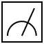

# 🛸 อยากรู้พื้นฐาน Quantum Computing? งั้นก็ลองสร้างมันขึ้นมาสิ!

สวัสดีท่านผู้เจริญซึ่งมากไปด้วยปัญญาที่อยากจะมาสัมผัสว่า Quantum Computing เนี่ยมันเป็นยังไง ในบทความนี้เราจะพาทุกท่านมาลองเขียน Quantum Circuit Simulator กัน พร้อมกับอธิบายคณิตศาสตร์คร่าวๆ ไปด้วย (ตามสไตล์ Developer/Engineer) ทั้งนี้ทั้งนั้น ตัว math เองอาจจะ simplified ไปสักหน่อย ในตอนจบบทความนี้เราเลยรวบรวมเว็บและแหล่งข้อมูลอื่นๆ ไว้ให้สำหรับคนที่อยากอ่านหรือศึกษาต่อได้ไปเรียนรู้กัน

ไม่รอช้า ไปเริ่มกันเลย!


**จ๊ะเอ๋ ตัวเอง!** ถ้ายังไม่รู้ว่าจริงๆ แล้ว Quantum Computing มันคืออะไรกันแน่ ทำไมต้อง Quantum นะ? เรียนเชิญไปอ่านบทความที่เขียนไว้คร่าวๆ ด้านล่างก่อนเลยจ้า 👇



[quantum](../my-subjects/quantum/)



**บทความนี้ ประกอบไปด้วยคณิตศาสตร์และภาษา JavaScript** ซึ่งจริงๆ แล้วคนอ่าน<mark style="color:orange;">**ไม่จำเป็นจะต้องรู้ทั้งสองอย่างก็ได้ อ่านไปเพลินๆ**</mark> แต่ถ้าอยากทำความเข้าใจกับคณิตศาสตร์ให้มากขึ้น หรืออยากเขียนโค้ดตามไปด้วย แนะนำว่าถ้ามีพื้นฐานเหล่านี้ก่อนอ่านสักหน่อยจะดีมาก:

* **JavaScript:** รู้จัก Array Method (`filter`, `map`, `reduce`, etc.) รู้จักการ Spread รู้จัก Higher-order Function รู้ว่าการ Currying คืออะไร
* **Linear Algebra:** ถ้าฟังภาษาอังกฤษได้แนะนำซีรีส์ Essence of linear algebra ของ 3Blue1Brown ([https://www.youtube.com/playlist?list=PLZHQObOWTQDPD3MizzM2xVFitgF8hE\_ab](https://www.youtube.com/playlist?list=PLZHQObOWTQDPD3MizzM2xVFitgF8hE\_ab))
* **Complex Number:** มาทบทวนเนื้อหา ม.5 กันค่ะ [http://www.tewlek.com/anet\_complex.html](http://www.tewlek.com/anet\_complex.html)


## Quantum Circuit คือ?


ปกติเวลาเราเขียนโปรแกรม เราก็เขียนโค้ดถูกมะ แต่ในควอนตัมคอมพิวเตอร์อ่ะ เราจะเขียนสิ่งที่เรียกว่า **"Quantum Circuit"** เข้าไป ถ้าจะให้เปรียบเทียบง่ายๆ ก็เหมืนกับการที่เราใส่ Logic Gate ลงไปในวงจร Digital เพื่อให้ได้ Output ตามที่เราต้องการ Quantum Computer ก็คือเป็นแบบนั้นเลย

แน่นอนว่า ใน Circuit เองก็ต้องมีส่วนประกอบที่น่าจะคุ้นเคยกัน 2 อย่าง นั่นก็คือ

* **Registers:** ถ้าพูดกันแบบ Digital Circuit ก็จะหมายถึงหน่วยความจำอะไรกันแบบนี้ใช่ไหม แต่ถ้าเป็น Quantum เราจะพูดถึงกลุ่มของเส้น Qubit หรือ Bit กัน ก็คือเส้นตามแนวนอนที่เห็นกันนั่นเอง โดย `q` ย่อมาจาก Quantum Register และ `c` มาจากคำว่า Classical Register
* **Gates:** ก็คือสิ่งที่แก้ไขให้ค่าใน Register เปลี่ยนแปลงไป ถ้าใน Digital Circuit เราก็อาจจะคุ้นกับ Logic Gate เช่น `AND`, `OR`, `NOT`, `XOR`, etc. ส่วนใน Quantum เราก็จะมี Quantum Gate กันมากมาย เช่น `X`, `Y`, `Z`, `Hadamard`, etc. ซึ่งในภาพก็คือสัญลักษณ์ที่วางอยู่บนเส้น Register นั่นเอง

จากแผนภาพ เราจะเห็นว่าการเขียนวงจรจะเขียนจากซ้ายไปขวา บนลงล่าง โดยเราจะเขียน Quantum Register ไว้ข้างบน แล้วเขียน Classical Register ไว้ด้านล่าง (สังเกตว่า Classical Register จะเป็นเส้นคู่ทั้งหมด) อย่างเส้นที่อยู่บนสุด ($$q_0$$) ก็คือคิวบิต 0 เส้นล่างสุด ($$c_2$$) ก็คือบิต 2 แล้วเราจะทำการเปลี่ยนแปลง Qubit ยังไง ก็ใส่ Quantum Gate ทับเส้นไปเลย หลังจากที่เราทำการเปลี่ยนแปลง Qubit แล้ว เราก็จะทำการวัดหรือ Measurement (สัญลักษณ์มิเตอร์ ) qubit ที่เราต้องการไปยัง bit ที่เราต้องการ (โดยทั่วไปก็วัดลงตรงๆ เลย $$q_0\to c_0, q_1\to c_1$$)

มาถึงตรงนี้หลายๆ คนคงสงสัย "เอ้า ในเมื่อมี Quantum Gate แล้ว ทำไมยังต้องวัดกลับมาอีก? ประมวลผลไปด้วยเครื่องควอนตัมคอมพิวเตอร์เลยไม่ได้หรอ?" คำตอบคือ เราจะใช้เครื่องควอนตัมคอมพิวเตอร์ในการแก้ปัญหาบางปัญหาที่ต้องพึ่งพาคุณสมบัติทางควอนตัมเท่านั้น บางปัญหานั้นก็สามารถทำได้หรือทำได้ดีกว่าด้วยเครื่องคอมพิวเตอร์ธรรมดา (Classical Computer) ที่เราใช้กันอยู่ ดังนั้น เราจึงมักจะทำวงจรควอนตัมมาเพื่อแก้ปัญหาบางอย่างเท่านั้น แล้วเอาข้อมูลที่ได้มาประมวลผลต่อด้วยคอมพิวเตอร์ปกติอีกที

ข้อสังเกตอีกอย่างหนึ่งที่น่าสนใจ คือ Logic Gate ที่อยู่ใน Digital Circuit เนี่ย อาจจะให้ผลลัพธ์ออกมาน้อยกว่าจำนวน Bit ที่เข้าไปก็ได้ ซึ่งใน Quantum เราไม่ทำกันแบบนั้นด้วยเหตุผลง่ายๆ ว่า สสารไม่มีวันสูญหายไป (ซึ่งจริงๆ ถ้าไม่ใช้ต่อก็ไม่ต้องสนใจมันแค่นั้นเอง)

ทั้งหมดที่เล่ามาก็คือ Quantum Circuit แบบคร่าวๆ ว่าคืออะไร และต่อจากนี้เราจะมาเขียนตัว Simulate เจ้านี่กัน ตั้งแต่การตั้ง Qubit การใส่ Gate ต่างๆ และการวัดผลลัพธ์ออกมาเลย


ในช่วงหลังจากนี้ จะมีการสอนทฤษฎีไปพร้อมๆ กับการเขียนโค้ด สำหรับคนที่มาอ่านเพลินๆ หรือมาเรียนเอาทฤษฎี Quantum Computing อย่างเดียว อาจจะเขียนโค้ดไม่เป็นหรือไม่อยากเขียนโค้ด ก็สามารถอ่านไปเพลินๆ โดยไม่ต้องสนใจโค้ดได้เลยจ้า ส่วนใครอยากต่อ Quantum Circuit ไปพร้อมๆ กับบทความ สามารถไปต่อได้ที่ [Quirk: Quantum Circuit Simulator (https://algassert.com/quirk)](https://algassert.com/quirk)


## Vector, Matrix, และ Basis

ก่อนที่จะไปทำ Simulator กันได้ เราต้องมาทบทวนเนื้อหาพื้นฐานกันก่อน

ถ้าเราย้อนกลับไปในวิชาฟิสิกส์ ม.ปลาย เราสามารถเขียนเวกเตอร์อันหนึ่งให้ออกมาในรูปองค์ประกอบของแกนได้ คือ

$$
\vec{F}=f_x\hat{\textbf{\i}}+f_y\hat{\textbf{\j}}
$$

เจ้าตัว $$\hat{\textbf{\i}}$$ กับ $$\hat{\textbf{\j}}$$ นี่แหละ เขาเรียกว่า Basis

**Basis** คือเวกเตอร์ 1 หน่วยที่อยู่ในแกนใดแกนหนึ่งก่อนที่จะถูกสเกลด้วยสเกลาร์ ตัวอย่างเช่นสมมติว่าเรามี

$$
\vec{A}=3\hat{\textbf{\i}}
$$

เราก็จะสามารถตอบได้ทันทีว่า $$\vec{A}$$ เป็นเวกเตอร์ที่มีขนาด 3 ในแนวแกน x โดยมี $$\hat{\textbf{\i}}$$ เป็นเวกเตอร์ 1 หน่วยในแนวแกน x ที่ถูกสเกลโดยสเกลาร์ $$3$$ ทำให้มันกลายเป็นเวกเตอร์ขนาด 3 ในแนวแกน x

โดยเราสามารถนำเวกเตอร์ใดเวกเตอร์หนึ่งมาเขียนในรูปของ matrix ได้แบบนี้

$$
\vec{F}=\begin{bmatrix}f_x\\f_y\end{bmatrix}
$$

ถ้าเราลองกระจาย matrix ออกมา เราจะได้ว่า

$$
\begin{align*} \vec{F}&=\begin{bmatrix}f_x\\f_y\end{bmatrix}\\ &=\begin{bmatrix}f_x\\0\end{bmatrix}+\begin{bmatrix}0\\f_y\end{bmatrix}\\ \vec{F}&=\vec{f_x}+\vec{f_y} \end{align*}
$$


ถ้ายังนึกไม่ออก ให้นึงถึงการแตกแรง


แต่! ถ้าเรายังไม่ลืม เราสามารถเขียนเวกเตอร์ในรูปของสเกลาร์คูณกับ Basis รวมกันได้ ซึ่งจะได้ว่า

$$
\begin{align*} \vec{F}&=\begin{bmatrix}f_x\\f_y\end{bmatrix}\\ &=\begin{bmatrix}f_x\\0\end{bmatrix}+\begin{bmatrix}0\\f_y\end{bmatrix}\\ &=f_x\begin{bmatrix}1\\0\end{bmatrix}+f_y\begin{bmatrix}0\\1\end{bmatrix}\\ \vec{F}&=f_x\hat{\textbf{\i}}+f_y\hat{\textbf{\j}} \end{align*}
$$

ก็คือ $$\hat{\textbf{\i}}=\begin{bmatrix}1\\0\end{bmatrix}$$ และ $$\hat{\textbf{\j}}=\begin{bmatrix}0\\1\end{bmatrix}$$ นั่นแหละ


ถ้าเป็นสามมิติก็แค่ขยาย matrix ออกอีก จะได้ว่า $$\hat{\textbf{\i}}=\begin{bmatrix}1\\0\\0\end{bmatrix}$$, $$\hat{\textbf{\j}}=\begin{bmatrix}0\\1\\0\end{bmatrix}$$ และ $$\hat{\textbf{k}}=\begin{bmatrix}0\\0\\1\end{bmatrix}$$ นั่นเอง


ใน Quantum Computing, เราจะเขียนแทนสถานะด้วยการใช้ Bra-ket Notation ซึ่งส่วนมากก็เขียนด้วย Ket อย่างเดียวแหละ เช่น $$\ket{\psi}$$ ก็อ่านว่า "เค็ต $$\psi$$"

การเขียนด้วยสัญลักษณ์ Ket เนี่ยเป็นการเขียนบ่งบอกสถานะของคิวบิตหรือกลุ่มคิวบิต เช่น $$\ket{0}$$คือสถานะ 0, $$\ket{1}$$ คือสถานะ 1 โดยในทาง Quantum Computing ก็มี Basis อยู่ด้วยกัน 2 ตัวคือ $$\ket{0}$$ กับ $$\ket{1}$$ เรียกว่า **Computational Basis** (ใช้ matrix เดียวกับ $$\hat{\textbf{\i}}$$, $$\hat{\textbf{\j}}$$) ดังนั้นเราจึงสามารถเขียนสถานะสถานะหนึ่งทาง Quantum ได้ว่า

$$
\ket{\psi}=\alpha\ket{0}+\beta\ket{1};\{\alpha,\beta\}\in\cnums
$$

เช่น

$$
\ket{+}=\frac{1}{\sqrt{2}}\ket{0}+\frac{1}{\sqrt{2}}\ket{1}
$$

$$
\ket{-i}=\frac{1}{\sqrt{2}}\ket{0}-\frac{i}{\sqrt{2}}\ket{1}
$$

สถานะทางควอนตัมที่เราใช้โดยทั่วไปเนี่ย ถ้าให้พูดแบบหยาบๆ คือต้อง normalized

สมมติว่ามีสถานะ $$\ket{\psi}$$ ตัวที่ยกตัวอย่างไป สถานะดังกล่าวจะต้องมีสมบัติว่า $$\braket{\psi\vert\psi}=|\alpha|^2+|\beta|^2=1$$ ซึ่งสถานะที่มีสมบัตินี้จะเรียกว่า Pure State ถ้าสถานะนั้นไม่มีสมบัตินี้ จะถือว่าเป็น Mixed State และต้องทำการ normalize ก่อน


เวลาเราหา Absolute ของ Complex Number เช่น สมมติว่าเรามี $$z=a+bi$$ เราจะได้ว่า $$|z|=\sqrt{\Re(z)^2+\Im(z)^2}=\sqrt{a^2+b^2}$$


โอเค ตอนนี้เราก็ทบทวนพื้นฐานที่ต้องรู้กันเสร็จแล้ว เราไปเขียนโค้ดเพื่อสร้าง Simulator ของเรากันเลย!

## Project Setup

เนื่องจากการทำ Quantum Circuit ต้องใช้การคำนวณ Matrix อย่างมหาศาล และต้องใช้ Complex Number อีกด้วย ดังนั้น เราจะมาใช้ library `math.js` กัน

เอาล่ะ ว่าแต่พวกนายอยากจะรันโปรเจกต์แบบไหนกันล่ะ?



1\. สร้างไฟล์ `index.html` มาก่อน แล้วใส่โค้ดนี้ไป


```html
<script src="https://cdn.jsdelivr.net/npm/mathjs@10.1.1/lib/browser/math.min.js"></script>
<script src="script.js"></script>
```


2\. พอเสร็จแล้ว ก็สร้างไฟล์ชื่อ `script.js` มาไว้ข้างๆ แล้วลองใส่คำสั่งข้างล่างดู


```javascript
console.log("Hello", math.sqrt(-1).toString())
```


3\. หลังจากนั้น ลองเข้าไฟล์ `index.html` แล้วเปิด Developer Console ขึ้นมา (ถ้าใช้ Chrome คำสั่งคือ `Ctrl+Shift+J`)

4\. ถ้าเห็นข้อความว่า "`Hello i`" แสดงว่าถูก ไปต่อได้

หลังจากนี้ ให้แก้ไขโค้ดในไฟล์ `script.js` แล้วพอเซฟ ก็ refresh หน้า `index.html` ใหม่



1\. รันคำสั่ง `npm init` (หรือ `yarn init`) แล้ว setup อะไรให้เรียบร้อยก่อน

2\. เสร็จแล้ว ลง math.js ด้วยคำสั่ง `npm install mathjs` (`yarn add mathjs`)

3\. ข้างในไฟล์ `package.json` ให้เพิ่ม field ไป 2 ตัว คือ


```json
{
  "scripts": {
    "start": "node index.js"
  },
  "type": "module"
}
```


4\. สร้างไฟล์ `index.js` โดยใส่โค้ดข้างในไว้ว่า


```javascript
import * as math from "mathjs";
console.log("Hello", math.sqrt(-1).toString())
```


5\. ลองรันโปรเจกต์ด้วยคำสั่ง `npm start` (`yarn start`)

6\. ถ้าเห็นข้อความว่า "`Hello i`" แสดงว่าถูก ไปต่อได้

หลังจากนี้ ให้แก้ไขโค้ดในไฟล์ `index.js` แล้วพอเซฟ ก็รันด้วยคำสั่ง `npm start` (`yarn start`)



หลังจาก setup Project ของเราเสร็จแล้ว ก็ถึงเวลาสร้าง Quantum Circuit Simulator ละ ไปกันต่อเลย!


สำหรับใครที่อยากได้ Source Code ทั้งหมดของบทความนี้ สามารถไปตาม Copy Paste ได้ที่ [https://gist.github.com/rootEnginear/642a5bba638a840a01765bd3eed49c7e](https://gist.github.com/rootEnginear/642a5bba638a840a01765bd3eed49c7e)


## สร้าง Quantum Basis States

ก่อนหน้านี้ เราได้เรียนรู้มาแล้วว่า $$\ket{0}=\begin{bmatrix}1\\0\end{bmatrix}$$ และ $$\ket{1}=\begin{bmatrix}0\\1\end{bmatrix}$$ เรามาลองโค้ดสถานะทั้งสองกันเลยดีกว่า

```javascript
const ket_0 = math.matrix([[1], [0]]);
const ket_1 = math.matrix([[0], [1]]);
```


**ระวังวิธีการใส่ Matrix ใน Math.js**

• `math.matrix([[1], [0]])` = $$\begin{bmatrix}1\\0\end{bmatrix}$$

• `math.matrix([1, 0])` = $$\begin{bmatrix}1,0\end{bmatrix}$$


ลอง `console.log` ออกมาดูกันว่าจะได้อะไรออกมานะ

```javascript
// อย่าลืม `.toString()` จะได้อ่านง่ายๆ
console.log("|0>", ket_0.toString())
console.log("|1>", ket_1.toString())
```


คลิก Run Pen เพื่อดูผลลัพธ์ที่ได้


เย้ ตอนนี้เราได้ Basis State กันแล้ว ไปต่อกันเลย!

## สร้าง Gate จาก Matrix

อย่างที่ได้พูดไปแล้วในตอน Quantum Circuit ว่า Gate คือสิ่งที่ทำการเปลี่ยนแปลงสถานะของ Qubit ไป ตอนนี้เรามีสถานะ Qubit แล้ว เรามาทำ Gate เพื่อเปลี่ยนสถานะของมันกัน

โดยเรามาเริ่มจาก Gate พื้นฐานที่สุด ก็คือ $$\mathrm{I}$$ gate โดย $$\mathrm{I}$$ gate มี matrix คือ

$$
\mathrm{I}=\begin{bmatrix}1&0\\0&1\end{bmatrix}
$$

```javascript
const i_matrix = math.matrix([
  [1, 0],
  [0, 1],
]);
```

อีก Gate ที่เป็นพื้นฐานก็คือ $$\mathrm{X}$$ gate โดยมี matrix คือ

$$
\mathrm{X}=\begin{bmatrix}0&1\\1&0\end{bmatrix}
$$

```javascript
const x_matrix = math.matrix([
  [0, 1],
  [1, 0],
]);
```

โดยวิธีการเอา Gate พวกนี้มาเปลี่ยนสถานะ Qubit คือให้เรานำ gate เหล่านี้ มาคูณกับสถานะที่เรามี เช่น ถ้าเราต้องการเอา $$\mathrm{I}$$ gate มาเปลี่ยนสถานะ $$\ket{0}$$ เราก็จะได้ว่า

$$
\begin{align*}
\mathrm{I}\ket{0}&=
\overbrace{\begin{bmatrix}1&0\\0&1\end{bmatrix}}^{\mathrm{I}}
\,
\overbrace{\begin{bmatrix}1\\0\end{bmatrix}}^{\ket{0}}
\\
\mathrm{I}\ket{0}&=\begin{bmatrix}1\\0\end{bmatrix}=\ket{0} \end{align*}
$$


ซึ่งก็ถูกต้อง เพราะถ้าใครจำหน้าตาของ Matrix $$\mathrm{I}$$ ได้ มันคือ Identity Matrix ที่คูณกับอะไรก็ได้ตัวเดิม

คราวนี้ถ้าสมมติเราจะทำสองครั้ง เช่น เอา $$\mathrm{X}$$ gate มาเปลี่ยนสถานะ $$\ket{0}$$ แล้วนำผลลัพธ์ไปทำกับ $$\mathrm{I}$$ gate อีกเราก็จะได้ว่า

$$
\begin{align*}
\mathrm{IX}\ket{0}&=
\overbrace{\begin{bmatrix}1&0\\0&1\end{bmatrix}}^{\mathrm{I}}\,
\overbrace{\begin{bmatrix}0&1\\1&0\end{bmatrix}}^{\mathrm{X}}\,
\overbrace{\begin{bmatrix}1\\0\end{bmatrix}}^{\ket{0}}\\
&=\begin{bmatrix}1&0\\0&1\end{bmatrix}\begin{bmatrix}0\\1\end{bmatrix}\\ \mathrm{IX}\ket{0}&=\begin{bmatrix}0\\1\end{bmatrix}=\ket{1} \end{align*}
$$


ซึ่งก็ถูกต้อง เพราะ $$\mathrm{X}$$ gate จะทำตัวคล้ายๆ กับ `NOT` gate คือเปลี่ยน 0 เป็น 1 เปลี่ยน 1 เป็น 0

เราสามารถสังเกตได้ว่า เวลาเรา<mark style="color:red;">**ทำการคูณ**</mark> เราจะเรียงลำดับจาก<mark style="color:red;">**ขวาไปซ้าย**</mark> แต่เวลาเรา<mark style="color:green;">**เขียนวงจรควอนตัม**</mark> เราจะเขียนจาก<mark style="color:green;">**ซ้ายไปขวา**</mark>

เรามาลอง implement ใน simulator ของเรากันดีกว่า ก่อนอื่นเราจะทำ wrapper function มาคอยรับส่งสถานะของเราก่อน แล้วก็ห่อ gate matrix ของเราไว้

```javascript
const applyGate = (gate) => (statevector) => math.multiply(gate, statevector);

const I = applyGate(i_matrix);
const X = applyGate(x_matrix);
```


Matrix ที่เก็บค่าสถานะของ Qubit จะเรียกว่า **State Vector**


หลังจากนั้น เราจะทำฟังก์ชันอีกอันมาใช้รันวงจรของเรา

```javascript
const execute = (starting_statevector, ...instructions) =>
  instructions.reduce(
    (previous_statevector, current_instruction) =>
      current_instruction(previous_statevector),
    starting_statevector
  );
```

ลองเอามาใช้รันวงจรเมื่อสักครู่กันเลย ว่าให้ผลลัพธ์ถูกไหม

```javascript
const toString = (statevector) => statevector.toString();

console.log("|0> ─I─");
console.log(execute(ket_0, I, toString));
console.log("|0> ─X─I─");
console.log(execute(ket_0, X, I, toString));
```


คลิก Run Pen เพื่อดูผลลัพธ์ที่ได้


สุดยอด ตอนนี้เราได้ Gate มาแล้ว 2 ตัวโดยการใช้ Matrix เราลองไปดู Gate อื่นๆ กันต่อเลย!

## สร้าง Gate จาก Universal Gate <a href="#universalgate" id="universalgate"></a>

Quantum Gate ทุกตัวสามารถสร้างได้จาก Universal Gate $$\mathrm{U}(\theta,\phi,\lambda)$$ ที่มีสมการว่า

$$
\mathrm{U}(\theta,\phi,\lambda)=\begin{bmatrix}\cos(\frac{\theta}{2})&-e^{i\lambda}\sin(\frac{\theta}{2})\\e^{i\phi}\sin(\frac{\theta}{2})&e^{i(\phi+\lambda)}\cos(\frac{\theta}{2})\end{bmatrix}
$$

ตัวอย่างเช่น $$\mathrm{Z}$$ gate ซึ่งสามารถเขียนได้ว่า

$$
\mathrm{Z}=\begin{bmatrix}1&0\\0&-1\end{bmatrix}=\mathrm{U}(0,0,\pi)
$$

มาลองโค้ดกัน เนื่องจากเราขี้เกียจที่จะมาเขียนฟังก์ชันอะไรยุ่งยาก เราให้ `math.js` parse จาก string เอาจะง่ายกว่า

```javascript
const U = (theta, phi, lambda) =>
  math.matrix([
    [
      math.evaluate(`cos(${theta}/2)`),
      math.evaluate(`-e^(i*${lambda})*sin(${theta}/2)`)
    ],
    [
      math.evaluate(`e^(i*${phi})*sin(${theta}/2)`),
      math.evaluate(`e^(i*${phi + lambda})*cos(${theta}/2)`),
    ],
  ]);

const z_matrix = U(0, 0, math.pi);
const Z = applyGate(z_matrix);
```

อีก Gate นึงที่เราจะมาทำกันก็คือ Hadamard Gate หรือเรียกกันสั้นๆ ว่า $$\mathrm{H}$$ gate

$$
\mathrm{H}=\frac{1}{\sqrt{2}}\begin{bmatrix}1&1\\1&-1\end{bmatrix}=\mathrm{U}(\frac{\pi}{2},0,\pi)
$$

```javascript
const h_matrix = U(math.pi / 2, 0, math.pi);
const H = applyGate(h_matrix);
```

Hadamard Gate เป็นสิ่งที่น่าตื่นตาตื่นใจมาก เพราะมันจะทำให้สถานะ $$\ket{0}$$ กลายเป็น $$\frac{1}{\sqrt{2}}\ket{0}+\frac{1}{\sqrt{2}}\ket{1}$$ หรือก็คือสิ่งที่เรียกว่า Superposition ที่เราพูดถึงกันนั่นเอง (เห็นใช่มะว่ามันเป็นได้ทั้ง 0 และ 1 ในเวลาเดียวกัน) ซึ่งวงจรส่วนใหญ่ก็ใช้ประโยชน์จากตรงนี้นี่แหละที่ทำให้เกิดเรื่องของ Quantum Advantage ขึ้น

เรามาลองทดสอบ Gate ทั้งสองอันที่สร้างขึ้นมาดีกว่า โดยปกติแล้ว $$\mathrm{Z}$$ gate จะไม่ได้ทำอะไรกับ $$\ket{0}$$ แต่เราจะใช้สมบัติอันนึง คือ $$\mathrm{HZH}=\mathrm{X}$$ มาตรวจกัน

```javascript
const toString = (statevector) => statevector.toString();

console.log("|0> ─H─");
console.log(execute(ket_0, H, toString));

console.log("|0> ─H─Z─H─");
console.log(execute(ket_0, H, Z, H, toString)); // Should get |1>
```


คลิก Run Pen เพื่อดูผลลัพธ์ที่ได้



เราอาจจะพบว่า $$\mathrm{HZH}\ket{0}$$ ที่เราทำจะได้ผลลัพธ์แปลกๆ ออกมา (`[[2.220446049250313e-16 + 1.224646799147353e-16i], [1 - 1.2246467991473532e-16i]]`) ซึ่งตรงนี้เกิดจากการคำนวณแล้วมันคลาดเคลื่อน ถ้าเราดูดีๆ `e-16` นี่เรียกว่าเหยียบ 0 ได้เลย ดังนั้นคำตอบแบบปัดๆ ก็คือ `[[0], [1]]` ($$\ket{1}$$) นั่นแหละ


เจ๋งมาก! เราไปดูกันต่อในส่วนที่สำคัญอีกส่วนหนึ่งของวงจร Quantum กันเลยดีกว่า นั่นก็คือ...

## การวัดสถานะ (Measurement)

หลังจากที่เราทำการสร้าง Qubit แล้วก็จับมันเปลี่ยนค่าไปเปลี่ยนค่ามาแล้ว เรามาทำการวัดมันดีกว่า

การวัดสถานะหรือ Measurement คือการที่เราเอาสถานะทาง Quantum มาดูว่ามันอยู่สถานะอะไร แต่สิ่งที่จะเกิดขึ้นเมื่อเราทำการวัดมันคือ สถานะมันจะ collapse ลงเป็นสถานะ $$\ket{0}$$ หรือ $$\ket{1}$$ เท่านั้น ต่อให้มันอยู่ในสถานะ Superposition มันก็จะโดนบังคับให้เลือกว่ามันจะเป็น $$\ket{0}$$ หรือ $$\ket{1}$$

แต่... ถึงแม้ว่ามันจะโดนบังคับให้เลือกเป็น $$\ket{0}$$ หรือ $$\ket{1}$$ แต่สิ่งหนึ่งที่เราสามารถทำได้ ก็คือ ดูว่ามันมี**โอกาส**ในการได้ค่า $$\ket{0}$$ หรือ $$\ket{1}$$ เท่าไร ซึ่งวิธีการที่ง่ายที่สุดก็คือเอาสถานะที่อยากรู้มา absolute แล้วยกกำลัง 2 เช่น

สมมติว่ามีสถานะทางควอนตัม $$\ket{A}=\frac{2}{\sqrt{5}}\ket{0}+\frac{1}{\sqrt{5}}\ket{1}$$ เราสามารถรู้ได้ว่า

* $$P(\ket{0})=|a_0|^2=|\frac{2}{\sqrt{5}}|^2=0.8$$
* $$P(\ket{1})=|a_1|^2=|\frac{1}{\sqrt{5}}|^2=0.2$$


วิธีการจริงๆ ของมัน คือเอา $$\ket{A}$$ project เข้า Computational Basis (Inner Product) แล้วคำนวณหาค่าที่อยู่ในโดเมน $$\Reals$$ ออกมา

* $$P(\ket{0})=|\braket{0\vert A}|^2$$
* $$P(\ket{1})=|\braket{1\vert A}|^2$$


ความสำคัญของค่าความน่าจะเป็นพวกนี้ คือ ถ้าเรารันวงจรเดิมๆ ซ้ำๆ หลายๆ ครั้ง ผลลัพธ์ที่ได้จะออกมาในสัดส่วนที่ใกล้เคียงกับความน่าจะเป็นที่คำนวณได้ เช่น เรามีสถานะ $$\mathrm{H}\ket{0}=\frac{1}{\sqrt{2}}\ket{0}+\frac{1}{\sqrt{2}}\ket{1}$$ ซึ่งเมื่อวัดแล้วจะได้ $$P(\ket{0})=0.5$$ และ $$P(\ket{1})=0.5$$ แปลว่าถ้ารันวงจร $$\mathrm{H}\ket{0}$$ สัก 1000 ครั้ง โอกาสที่จะวัดค่า Qubit แล้วได้ $$\ket{0}$$ ก็จะมีประมาณ 500 ครั้ง และก็วัดได้ $$\ket{1}$$ อีกสักประมาณ 500 ครั้ง **ประมาณนะ** อาจจะได้น้อยกว่ามากกว่าหน่อยๆ แต่รวมๆ แล้วสัดส่วนจะอยู่แถวๆ 50/50 แหละ

ถ้าเราเอาวิธีการคำนวณความน่าจะเป็นดังกล่าว มาคูณจำนวนรอบที่จะทำ เราก็จะได้ค่าแบบตรงเป๊ะๆ มาเลย ซึ่งแน่นอนว่าผลลัพธ์มัน too perfect ไปไม่เหมือนเครื่องควอนตัมคอมพิวเตอร์จริงๆ ที่มี uncertainty และปัจจัยหลายๆ อย่าง อีกทั้งวิธีดังกล่าวจะสามารถใช้วัดวงจรตอนได้แค่ตอนท้ายเท่านั้น ซึ่งจะมีปัญหากับวงจรหลายๆ Qubit เพราะอาจจะวัดแต่ละ Qubit ไม่พร้อมกันก็ได้ ดังนั้นเราจึงไม่สามารถใช้วิธีที่ obvious แบบนี้ได้

โอเค แล้วเราจะ implement ตัว Measurement ของเรายังไงถ้าไม่ใช้วิธีการนี้?

เราก็เขียนฟังก์ชันการ measure ด้วยการ**จำลองการ collapse ของสถานะ**เลยยังไงล่ะ!

ขั้นตอนการทำคำสั่ง measurement แบบนี้มีอยู่ 3 ขั้นตอน

1. คำนวณว่าความน่าจะเป็นของแต่ละสถานะมีค่าเท่าไรด้วยสูตรที่สอนไปแล้ว
2. เอาความน่าจะเป็นมาสุ่มจริงๆ ด้วย `Math.random()` เพื่อ simulate uncertainty ด้วยวิธีนี้เราจะได้สถานะที่ Win มา
3. ทำให้สถานะอื่นที่ไม่ Win กลายเป็น 0 โดยการทำ Post-selecting ซึ่งการ post-selecting นี้จะทำให้ State Vector ไม่ normalized
4. ทำการ Normalize State

โอเค เรามาเริ่ม implement ฟังก์ชันต่างๆ กัน

### Normalizing State

วิธีการ normalize State เราสามารถทำได้โดยการนำสถานะนั้น (เช่น $$\ket{\psi}=\alpha\ket{0}+\beta\ket{1};|\alpha|^2+|\beta|^2\,{\color{red}\neq1}$$) มาหารด้วย square root ของ norm ของสถานะนั้น คือ

$$
\ket{\psi'}=\frac{\ket{\psi}}{\sqrt{\braket{\psi\vert\psi}}}
$$

```javascript
const complexMatrixNorm = (statevector) =>
  statevector
    .map((state) => math.abs(state) ** 2)
    .toArray()
    .flat()
    .reduce((acc, cur) => acc + cur, 0);

const normalizeState = (state) => {
  const sqrt_norm = math.sqrt(complexMatrixNorm(state));
  // Norm will never < 0, but can = 0
  if (sqrt_norm === 0) throw new Error("Norm is 0!");
  return math.divide(state, math.sqrt(complexMatrixNorm(state)));
};
```

### Post-selecting

การ Post-selecting คือการเลือกเฉพาะ State ที่เราอยากได้ แล้วโยน State ที่เหลือทิ้ง วิธีการนี้อย่างที่บอกไปแล้วว่ามันจะทำให้ State ไม่ Normalized เนื่องจากเวลาเราโยนบาง State ทิ้งแล้ว จะทำให้ความน่าจะเป็นรวมกันแล้วไม่ได้ 1 โดยการ Post-select ก็มี 2 แบบ คือ เลือก $$\ket{0}$$ กับเลือก $$\ket{1}$$

$$
\begin{align*} \ket{0}\bra{0}&=\begin{bmatrix}1&0\\0&0\end{bmatrix}\\ \ket{1}\bra{1}&=\begin{bmatrix}0&0\\0&1\end{bmatrix} \end{align*}
$$

```javascript
const postselect0_matrix = math.matrix([
  [1, 0],
  [0, 0],
]);

const postselect1_matrix = math.matrix([
  [0, 0],
  [0, 1],
]);
```

ตอนนี้เราเตรียมฟังก์ชันสำหรับการ Normalize State กับ Post-selecting ไว้แล้ว เรามา implement ฟังก์ชันสำหรับการทำ Measurement กัน

### Implementing the Measurement

#### 1. คำนวณหาความน่าจะเป็นจาก State Vector

โอเค ขั้นตอนแรก เราต้องทำการคำนวณความน่าจะเป็นออกมาก่อน แต่ก่อนที่เราจะทำได้ เราต้องนึกถึงเวลาที่มีหลาย Qubit อยู่ด้วย เอาเป็นว่าในตอนนี้แบบคร่าวๆ คือ เวลาเรามีหลาย Qubit ใน Quantum Circuit, State Vector ก็จะแสดงสถานะของทุก state ออกมาเลย แบบนี้

$$
\ket{q_1q_0}=\alpha\ket{00}+\beta\ket{01}+\gamma\ket{10}+\delta\ket{11}=\begin{bmatrix}\alpha\\\beta\\\gamma\\\delta\\\end{bmatrix}
$$

เวลาทำการ Measurement เราจะต้องเลือกวัด qubit ตัวใดตัวหนึ่ง ในกรณีนี้ ถ้าเราเลือกที่จะวัด $$q_0$$ ความน่าจะเป็นของมันคือ

$$
P(\braket{q_10\vert q_1q_0})=|\alpha|^2+|\gamma|^2\\ P(\braket{q_11\vert q_1q_0})=|\beta|^2+|\delta|^2
$$

จะเห็นว่า การที่เราจะหาว่าความน่าจะเป็นของการวัด $$q_0$$ แล้วจะได้ $$\ket{0}$$ เนี่ย เราต้องเอาความน่าจะเป็นของ $$\ket{00}$$ กับ $$\ket{10}$$ มารวมกัน เพราะทั้งสองตัวมี $$q_0=\ket{0}$$ เหมือนกัน (สำหรับวัดแล้วได้ 1 ก็ใช้วิธีเดียวกัน)

แน่นอนว่าถ้าเราวัดที่ $$q_1$$ ก็จะได้เป็น

$$
P(\braket{0q_0\vert q_1q_0})=|\alpha|^2+|\beta|^2\\ P(\braket{1q_0\vert q_1q_0})=|\gamma|^2+|\delta|^2
$$

น่าจะพอเห็นภาพเนอะ กลับไปที่ฟังก์ชันของเรา

ในการหาความน่าจะเป็นแบบนี้ เราจะเอา State Vector มาเลือกเฉพาะตัวที่มี $$q_x$$ (เมื่อ $$x$$ คือ Qubit ที่จะวัด) เป็น $$\ket{0}$$ เท่านั้น แล้วคิดความน่าจะเป็นออกมาตามสูตร

```javascript
const M = (qubit) => (state) => {
  // 1.) Extract relevant probability
  const qubit_ket0_prob = state
    .toArray()
    .flat()
    .filter((_, i) => (i & (1 << qubit)) === 0)
    .map((c) => math.abs(c) ** 2)
    .reduce((a, b) => a + b, 0);
    
  //...
};
```

#### 2. สุ่มโอกาสที่จะได้

ถึงพาร์ทที่น่าสนุกของเราแล้ว โดยในพาร์ทนี้เราจะเอาความน่าจะเป็นในรอบที่แล้วมาเป็นตัวเลือกว่าจะโดน Post-selecting แบบไหน โดยเราจะทำการ

1. สร้าง Array ตามจำนวน qubit ขึ้นมาก่อน แล้วเติมทั้งหมดด้วย $$\mathrm{I}$$ gate
2. เปลี่ยนค่าที่ $$x$$ เป็น Post-selecting $$\ket{0}$$ หรือ $$\ket{1}$$ ตามผลการสุ่ม
3. เอา Array มาสร้าง Matrix เพื่อ post-selecting State Vector โดยใช้ Tensor Product (ซึ่งจะอธิบายในอนาคตตอนเราขยายวงจรเป็นหลาย qubit กัน 😉)

เราจะได้ implementation ดังนี้

```javascript
const M = (qubit) => (state) => {
  // 1.) Extract relevant probability
  const qubit_ket0_prob = state
    .toArray()
    .flat()
    .filter((_, i) => (i & (1 << qubit)) === 0)
    .map((c) => math.abs(c) ** 2)
    .reduce((a, b) => a + b, 0);
    
  // 2.) Categorize probability
  const qubit_count = math.log2(state.toArray().length);
  
  let postselect_set = new Array(qubit_count).fill(i_matrix);
  postselect_set[qubit] =
    Math.random() <= qubit_ket0_prob ? postselect0_matrix : postselect1_matrix;
  const postselector = postselect_set.reduce((prev, cur) => math.kron(cur, prev));
  
  //...
};
```

#### 3. Post-selecting และ Normalization

อันนี้ก็ตรงไปตรงมาตามชื่อเลยเพราะเราทำฟังก์ชันไว้แล้ว

```javascript
const M = (qubit) => (state) => {
  // 1.) Extract relevant probability
  const qubit_ket0_prob = state
    .toArray()
    .flat()
    .filter((_, i) => (i & (1 << qubit)) === 0)
    .map((c) => math.abs(c) ** 2)
    .reduce((a, b) => a + b, 0);
    
  // 2.) Categorize probability
  const qubit_count = math.log2(state.toArray().length);
  
  let postselect_set = new Array(qubit_count).fill(i_matrix);
  postselect_set[qubit] =
    Math.random() <= qubit_ket0_prob ? postselect0_matrix : postselect1_matrix;
  const postselector = postselect_set.reduce((prev, cur) => math.kron(cur, prev));
  
  // 3.) Apply postselect gate & normalize
  const postselected_state = math.multiply(postselector, state);
  try {
    return normalizeState(postselected_state);
  } catch (error) {
    // This can only happen if the postselected state is zero matrix.
    // In this case, we just return the `postselected_state` (because it's zero).
    return postselected_state;
  }
};
```

เสร็จสักที มาลองกันเลยว่าจะปังหรือพัง โดยเราจะรันวงจร $$\mathrm{H}\ket{0}$$ สัก 10 ทีว่าจะได้ผลลัพธ์ออกมายังไง

```javascript
const toString = (statevector) => statevector.toString();

console.log("|0> ─H─M─");
new Array(10).fill().forEach(() => {
  // M(0) -> Measure at qubit 0
  console.log(execute(ket_0, H, M(0), toString));
});
```


คลิก Run Pen เพื่อดูผลลัพธ์ที่ได้


ลองกดเล่นแล้วกด Rerun ดูว่าได้ผลลัพธ์ออกมายังไงบ้าง จากทฤษฎีก็ควรจะได้ 50/50 ระหว่าง $$\ket{0}$$ กับ $$\ket{1}$$ เนอะ

เอาเป็นว่า ตอนนี้สรุปได้ว่าที่อุตสาห์ทำมา เวิร์คค่ะ :heart:

ไปต่อกันค่ะ

## Repeat Execution & Aggregate Results

อย่างที่บอกไปในส่วนที่แล้ว เวลาเรารัน Quantum Circuit เราก็ต้องรันวงจรเดิมซ้ำๆ ไปหลายๆ รอบ เพื่อให้เรามั่นใจได้ว่าผลลัพธ์ของเราจะถูกต้องหรือมีความน่าจะเป็นตามทฤษฎีจริงๆ ในส่วนนี้ เราจะมาเขียนฟังก์ชันที่ทำให้ชีวิตเราง่ายขึ้นกัน

อย่างแรก เราจะเขียนฟังก์ชันที่เอาไว้รันซ้ำๆ ตามจำนวนที่เราต้องการ แล้วคืนค่าผลลัพธ์ใส่ Array มาให้เรา

```javascript
const repeatExecution = (starting_statevector, ...instructions) => (shots) =>
  new Array(shots)
    .fill()
    .map(() => execute(starting_statevector, ...instructions));
```

ไหนลอง

```javascript
const toString = (statevector) => statevector.toString();

console.log("|0> ─H─M─ × 100");
console.log(repeatExecution(ket_0, H, M(0), toString)(100));
```


คลิก Run Pen เพื่อดูผลลัพธ์ที่ได้


อลังการ แต่แอบอ่านยากนะ เรามาเขียนฟังก์ชันที่รวบรวมข้อมูลให้เราดีกว่า จะได้เข้าใจง่ายๆ

```javascript
const aggregateResult = (result_list) => {
  const aggregated_result = result_list
    .map((result) => result.toString())
    .reduce((cnt, cur) => {
      return (cnt[cur] = cnt[cur] + 1 || 1), cnt;
    }, {});

  return aggregated_result;
};
```

เสร็จแล้ว เราก็ทำฟังก์ชันที่รันวงจรตามจำนวนที่บอก แล้วก็สรุปผลออกมาให้เราด้วยเลย

```javascript
const runAndAggregate = (starting_statevector, ...instructions) => (shots) =>
  aggregateResult(
    repeatExecution(starting_statevector, ...instructions)(shots)
  );
```

ไหนลอง

```javascript
console.log("Σ(|0> ─H─M─ × 1000)");
console.log(runAndAggregate(ket_0, H, M(0))(1000));
```


คลิก Run Pen เพื่อดูผลลัพธ์ที่ได้


เก่งมากท่านผู้เจริญที่ผ่านมาถึงจุดนี้ได้ ในตอนนี้เราก็สามารถสร้างสถานะของ Qubit ตัวหนึ่งขึ้นมา ทำการเปลี่ยนแปลงสถานะ แล้ววัดเอาผลลัพธ์ของสถานะนั้นๆ ได้แล้ว หลังจากนี้ เราจำทำการเพิ่มจำนวน Qubit ลงไปใน Simulator ของเรากัน

เดี๋ยวเรามาพักเบรกกันก่อน ระหว่างนี้ เชิญรับชมสิ่งที่น่าสนใจกันก่อนดีกว่า



## ขยับขยายจำนวน Qubit <a href="#expandingqubits" id="expandingqubits"></a>

หลังจากที่เราทำวงจรขนาด 1 qubit กันมาได้แล้ว เรามาลองเพิ่มจำนวน qubit ในระบบกัน โดยวิธีการเพิ่มเข้าไปก็ง่ายมาก คือใช้สิ่งที่เรียกว่า **"Tensor Product"**


#### Tensor Product

สมมติว่าเรามี matrix $$A=\begin{bmatrix}a_{00}&a_{01}\\a_{10}&a_{11}\end{bmatrix}$$ และ matrix $$B=\begin{bmatrix}b_{00}&b_{01}\\b_{10}&b_{11}\end{bmatrix}$$ Tensor Product ของ A และ B ก็คือ

$$\begin{align*} A\otimes B&=\begin{bmatrix}a_{00}B&a_{01}B\\a_{10}B&a_{11}B\end{bmatrix}\\ &=\begin{bmatrix} a_{00}\begin{bmatrix}b_{00}&b_{01}\\b_{10}&b_{11}\end{bmatrix} &a_{01}\begin{bmatrix}b_{00}&b_{01}\\b_{10}&b_{11}\end{bmatrix} \\ a_{10}\begin{bmatrix}b_{00}&b_{01}\\b_{10}&b_{11}\end{bmatrix} &a_{11}\begin{bmatrix}b_{00}&b_{01}\\b_{10}&b_{11}\end{bmatrix} \end{bmatrix}\\ A\otimes B&=\begin{bmatrix} a_{00}b_{00}&a_{00}b_{01}&a_{01}b_{00}&a_{01}b_{01}\\ a_{00}b_{10}&a_{00}b_{11}&a_{01}b_{10}&a_{01}b_{11}\\ a_{10}b_{00}&a_{10}b_{01}&a_{11}b_{00}&a_{11}b_{01}\\ a_{10}b_{10}&a_{10}b_{11}&a_{11}b_{10}&a_{11}b_{11}\\ \end{bmatrix} \end{align*}$$

วิธีการจำคือ **เอาขวาใส่ซ้าย** แล้วก็คูณให้เรียบร้อยก็จะได้ออกมาแล้ว

:warning: **ข้อควรระวัง:** Operator นี้ไม่ Communicative นาจา ($$A\otimes B\neq B\otimes A$$) ยกเว้น $$A=B$$


### Combining Basis State

เราลองเอา Basis State มารวมกันด้วย Tensor Product กันดีกว่า

$$
\begin{align*} \ket{00}&=\ket{0}\otimes\ket{0}&=\begin{bmatrix}1\\0\end{bmatrix}\otimes\begin{bmatrix}1\\0\end{bmatrix}&=\begin{bmatrix}1\\0\\0\\0\end{bmatrix}\\ \ket{01}&=\ket{0}\otimes\ket{1}&=\begin{bmatrix}1\\0\end{bmatrix}\otimes\begin{bmatrix}0\\1\end{bmatrix}&=\begin{bmatrix}0\\1\\0\\0\end{bmatrix}\\ \ket{10}&=\ket{1}\otimes\ket{0}&=\begin{bmatrix}0\\1\end{bmatrix}\otimes\begin{bmatrix}1\\0\end{bmatrix}&=\begin{bmatrix}0\\0\\1\\0\end{bmatrix}\\ \ket{11}&=\ket{1}\otimes\ket{1}&=\begin{bmatrix}0\\1\end{bmatrix}\otimes\begin{bmatrix}0\\1\end{bmatrix}&=\begin{bmatrix}0\\0\\0\\1\end{bmatrix} \end{align*}
$$

สังเกตว่าตอนนี้เราได้ Basis States ต่างๆ ของ 2 qubit มาแล้ว ซึ่งเราจะสามาระเอาไปใช้กับวงจรขนาด 2 qubit ได้

### Combining Single-qubit Gates

คราวนี้เราลองเอา gate มารวมกันดีกว่า เดี๋ยวเรามาดูกันว่า การเอา $$\mathrm{I}$$ gate กับ $$\mathrm{X}$$ gate มารวมกันจะได้ผลลัพธ์อย่างไรบ้าง และสามารถวาดออกมาเป็น Quantum Circuit ได้อย่างไร

$$
\begin{align*} \mathrm{I}\otimes\mathrm{I}&=\begin{bmatrix}1&0\\0&1\end{bmatrix}\otimes\begin{bmatrix}1&0\\0&1\end{bmatrix}&=\begin{bmatrix}1 & 0 & 0 & 0 \\ 0 & 1 & 0 & 0 \\ 0 & 0 & 1 & 0 \\ 0 & 0 & 0 & 1\end{bmatrix}\\ \mathrm{I}\otimes\mathrm{X}&=\begin{bmatrix}1&0\\0&1\end{bmatrix}\otimes\begin{bmatrix}0&1\\1&0\end{bmatrix}&=\begin{bmatrix}0 & 1 & 0 & 0 \\ 1 & 0 & 0 & 0 \\ 0 & 0 & 0 & 1 \\ 0 & 0 & 1 & 0\end{bmatrix}\\ \mathrm{X}\otimes\mathrm{I}&=\begin{bmatrix}0&1\\1&0\end{bmatrix}\otimes\begin{bmatrix}1&0\\0&1\end{bmatrix}&=\begin{bmatrix}0 & 0 & 1 & 0 \\ 0 & 0 & 0 & 1 \\ 1 & 0 & 0 & 0 \\ 0 & 1 & 0 & 0\end{bmatrix}\\ \mathrm{X}\otimes\mathrm{X}&=\begin{bmatrix}0&1\\1&0\end{bmatrix}\otimes\begin{bmatrix}0&1\\1&0\end{bmatrix}&=\begin{bmatrix}0 & 0 & 0 & 1 \\ 0 & 0 & 1 & 0 \\ 0 & 1 & 0 & 0 \\ 1 & 0 & 0 & 0\end{bmatrix} \end{align*}
$$


เราจะเห็นว่าในกรณีที่มี Gate อยู่ที่ qubit ใด qubit หนี่ง เราจะต้อง Tensor Product qubit ที่ไม่มีการเปลี่ยนแปลงกับ $$\mathrm{I}$$ gate ด้วย เพื่อทำให้ matrix ของเรามีขนาดเท่ากับ State Vector และสามารถทำการคำนวณได้นั่นเอง

มาลองโค้ดกันเถอะ! เดี๋ยวเรามาลองทำวงจร $$(\mathrm{H}\otimes\mathrm{X})\ket{00}$$ กัน


```javascript
const toString = (statevector) => statevector.toString();

const ket_00 = math.kron(ket_0, ket_0);

const HX = applyGate(math.kron(h_matrix, x_matrix));

console.log(`|0> ─X─\n|0> ─H─`);
console.log(execute(ket_00, HX, toString));
```


คลิก Run Pen เพื่อดูผลลัพธ์ที่ได้


## 2-qubit Gates

ตอนนี้เราก็อาจจะรู้แล้วว่าเราสามารถสร้าง Gate ขนาด 2 qubit ได้จากการเอา Gate ขนาด 1 qubit มา Tensor Product กัน ในคราวนี้ เราจะมารู้จักกับ Gate ขนาด 2 qubit ที่ใช้บ่อยๆ กัน

### Controlled-not Gate (CNOT)


Controlled-not Gate ($$\mathrm{CNOT}$$) เป็น Gate ชนิดหนึ่งที่จะประกอบไปด้วยส่วนประกอบสองส่วน คือ

1. Control คือจุดสีดำ $$\bullet$$
2. Target คือเครื่องหมาย $$\oplus$$

โดยมันจะทำการสลับสถานะ $$\ket{01}$$ กับ $$\ket{11}$$ ใน State Vector ที่ถูกทำ

$$
\ket{\psi}=\begin{bmatrix}\alpha\\{\color{red}\beta}\\\gamma\\{\color{green}\delta}\end{bmatrix}\to\mathrm{CNOT}\ket{\psi}=\begin{bmatrix}\alpha\\{\color{green}\delta}\\\gamma\\{\color{red}\beta}\end{bmatrix}
$$

โดย $$\mathrm{CNOT}$$ มี matrix คือ

$$
\mathrm{CNOT}=\begin{bmatrix}1&0&0&0\\0&0&0&1\\0&0&1&0\\0&1&0&0\end{bmatrix}
$$


ถ้าไปเปิดหนังสือฟิสิกส์บางเล่ม อาจจะเจอว่า $$\mathrm{CNOT}=\begin{bmatrix}1&0&0&0\\0&1&0&0\\0&0&0&1\\0&0&1&0\end{bmatrix}$$ ซึ่งจริงๆ นี่ก็เป็นรูปหนึ่งของ $$\mathrm{CNOT}$$ เช่นกัน ความแตกต่างคือ ใน Tutorial นี้เราจะเรียง Qubit ในสัญลักษณ์ Ket โดย**เอา LSB ไว้ทางขวา**และเอา MSB ไว้ทางซ้าย พูดง่ายๆ คือ $$q_n$$ จะอยู่ทางซ้ายสุด และ $$q_0$$ จะอยู่ทางขวาสุดเสมอ (เหมือนเขียนเลขฐาน 2) เมื่อเราใช้การเรียงลำดับของ Qubit ตามที่บอกแล้ว $$\mathrm{CNOT}$$ ก็จะเป็น matrix ตามที่บอกไปเลย ส่วน $$\mathrm{CNOT}=\begin{bmatrix}1&0&0&0\\0&1&0&0\\0&0&0&1\\0&0&1&0\end{bmatrix}$$จะมีวงจรควอนตัมเป็น  แทน (คือ qubit 1 จะเป็น Control และ qubit 0 จะเป็น Target)

หลังจากนี้  อาจจะโผล่มาในบทความบ้าง ขอเรียกว่า $$\mathrm{CNOT}'$$ นะ



บางครั้งคนก็จะเรียก $$\mathrm{CNOT}$$ ว่า Controlled-$$\mathrm{X}$$ gate เพราะ implementation ของมันก็คือการเอา $$\mathrm{X}$$ gate มาผูกกับ Control นั่นแหละ


เรามาลองทำวงจร... เอ่อ ใช้ภาพละกัน


ก่อนอื่น เราจะต้องสร้าง $$\mathrm{IH}$$ gate มาก่อน แล้วก็แปะ $$\mathrm{CNOT}$$ ต่อ แล้วปิดท้ายด้วยการ Measurement

เนื่องจากตอนเราทำฟังก์ชัน Measurement เราทำให้มันสามารถทำงานแยก Qubit ได้ เราจึงไม่ต้องไป Tensor Product อะไรกับ $$\mathrm{I}$$ gate แค่บอก qubit ที่จะวัดก็พอ

```javascript
const IH = applyGate(math.kron(i_matrix, h_matrix));

const cnot_matrix = math.matrix([
  [1, 0, 0, 0],
  [0, 0, 0, 1],
  [0, 0, 1, 0],
  [0, 1, 0, 0]
]);
const CNOT = applyGate(cnot_matrix);

console.log("|0> ─H─╭@─M─\n|0> ───╰X─M─");
console.log(runAndAggregate(ket_00, IH, CNOT, M(0), M(1))(1000));
```


คลิก Run Pen เพื่อดูผลลัพธ์ที่ได้


สังเกตว่า เราจะได้ผลลัพธ์เป็น $$\ket{00}$$ หรือ $$\ket{11}$$ ออกมาประมาณ 50/50 โดยสิ่งที่เราเพิ่งทำไปก็คือการทำ Entanglement ระหว่าง Qubit นั่นเอง

หลายๆ คนอาจจะเคยได้ยินปรากฏการณ์ทางควอนตัมอันหนึ่ง คือ Entanglement ซึ่งหลายๆ คนอาจจะเคยได้ยินมาทำนองว่า "ถ้าเรารู้สถานะของตัวหนึ่ง เราก็จะสามารถรู้สถานะของอีกตัวหนึ่งที่ entangle อยู่ได้" ซึ่ง roughly speaking ก็ถูกนะ

แต่สิ่งหนึ่งที่ทุกคนต้องเข้าใจคือ Entanglement ทำให้เราแค่ "รู้" อีกตัว ไม่ใช่ว่าเปลี่ยนตัวหนึ่งแล้วอีกตัวหนึ่งจะเปลี่ยนตาม ตรงนี้มองว่าคนหลายคนเข้าใจผิดกันไปเยอะมาก คือเราแค่รู้อีกตัวนะ ไม่ใช่ว่ามันจะเปลี่ยนตามกัน

เรามาทดลองกันเพิ่มดีกว่า จะเกิดอะไรขึ้นถ้าเราวัดแค่ $$q_0$$ ล่ะ?


```javascript
console.log("|0> ─H─╭@─M─\n|0> ───╰X───");
console.log(runAndAggregate(ket_00, IH, CNOT, M(0))(1000));
```


คลิก Run Pen เพื่อดูผลลัพธ์ที่ได้


สังเกตว่าก็จะได้คำตอบเหมือนเดิม คือ $$\ket{00}$$ หรือ $$\ket{11}$$ วัดบิตเดียว รู้อีกอัน นี่แหละคือพลังของ Entanglement


เรามาลองดู math เบื้องหลังวงจรนั้นดีกว่า

$$
\begin{align*} (\mathrm{CNOT})(\mathrm{I}\otimes\mathrm{H})\ket{00}&=\frac{1}{\sqrt{2}}\begin{bmatrix}1&0&0&0\\0&0&0&1\\0&0&1&0\\0&1&0&0\end{bmatrix}\begin{bmatrix}1&1&0&0\\1&-1&0&0\\0&0&1&1\\0&0&1&-1\end{bmatrix}\begin{bmatrix}1\\0\\0\\0\end{bmatrix}\\ &=\frac{1}{\sqrt{2}}\begin{bmatrix}1&0&0&0\\0&0&0&1\\0&0&1&0\\0&1&0&0\end{bmatrix}\begin{bmatrix}1\\1\\0\\0\end{bmatrix}\\ &=\frac{1}{\sqrt{2}}\begin{bmatrix}1\\0\\0\\1\end{bmatrix}\\ (\mathrm{CNOT})(\mathrm{I}\otimes\mathrm{H})\ket{00}&=\frac{1}{\sqrt{2}}\ket{00}+\frac{1}{\sqrt{2}}\ket{11} \end{align*}
$$

จากข้างบน เราก็จะเห็นแล้วว่าวงจรมีโอกาสออก$$\ket{00}$$ หรือ $$\ket{11}$$ อย่างละ 50/50 โดยถ้าเราทำการวัดที่ $$q_0$$ เราก็จะได้ว่า

$$
\begin{align*}
\braket{q_10\vert(\mathrm{CNOT})(\mathrm{I}\otimes\mathrm{H})\vert 00}
&=
\frac
{
\frac{1}{\sqrt{2}}\ket{00}+
\cancel{0\ket{01}}+
0\ket{10}+
\cancel{\frac{1}{\sqrt{2}}\ket{11}}
}
{
\sqrt{\left|\frac{1}{\sqrt{2}}\right|^2+
\cancel{|0|^2}+
|0|^2+
\cancel{\left|\frac{1}{\sqrt{2}}\right|^2}}
}
&=
\ket{00}\\
\braket{q_11\vert(\mathrm{CNOT})(\mathrm{I}\otimes\mathrm{H})\vert 00}
&=
\frac
{\cancel{\frac{1}{\sqrt{2}}\ket{00}}+0\ket{01}+\cancel{0\ket{10}}+\frac{1}{\sqrt{2}}\ket{11}}
{
\sqrt{\cancel{\left|\frac{1}{\sqrt{2}}\right|^2}+
|0|^2+
\cancel{|0|^2}+
\left|\frac{1}{\sqrt{2}}\right|^2}
}
&=
\ket{11}
\end{align*}
$$

นั่นก็คือ จะทำให้ State หลงเหลือ $$\ket{00}$$ เมื่อวัด $$q_0\to\ket{0}$$ และเหลือแค่ $$\ket{11}$$ เมื่อวัด $$q_0\to\ket{1}$$


**Partial Measurement:** เลือก Related State ก่อน (Post-selecting; เลือก State ที่มี**ตัวบังคับ**เหมือนกัน) แล้ว Normalization


เราก็จะเห็นแล้วว่า $$\mathrm{CNOT}$$ มีความสำคัญต่อวงจรควอนตัมในแง่ที่ว่า จะเป็นตัวสลับสถานะและสามารถทำให้เกิดการ Entanglement กันขึ้นระหว่าง Qubit ได้

เดี๋ยวเรามารู้จัก 2-qubit Gate อีกตัวนึงกันดีกว่า มันคือ

### SWAP Gate


$$\mathrm{SWAP}$$ gate เป็น Gate ที่จะสลับ 2 Qubit ที่อยู่ติดกัน มีประโยชน์มากโดยเฉพาะในกรณีที่ต้องการสลับ Control กับ Target ของ $$\mathrm{CNOT}$$ gate


โดย $$\mathrm{SWAP}$$ gate มี matrix คือ

$$
\mathrm{SWAP}=\begin{bmatrix}1&0&0&0\\0&0&1&0\\0&1&0&0\\0&0&0&1\end{bmatrix}
$$

$$\mathrm{SWAP}$$ gate มีสมบัติที่สำคัญ คือ

$$
\mathrm{SWAP}=\mathrm{CNOT}(\mathrm{CNOT}')\mathrm{CNOT}=\mathrm{CNOT}(\mathrm{H}\otimes\mathrm{H})\mathrm{CNOT}(\mathrm{H}\otimes\mathrm{H})\mathrm{CNOT}
$$


มาลอง implement $$\mathrm{SWAP}$$ gate กัน แล้วทดสอบด้วยวงจร $$\mathrm{SWAP}(\mathrm{I}\otimes\mathrm{X})\ket{00}$$


```javascript
const toString = (statevector) => statevector.toString();

const ket_00 = math.kron(ket_0, ket_0);

const IX = applyGate(math.kron(i_matrix, x_matrix));

const swap_matrix = math.matrix([
  [1, 0, 0, 0],
  [0, 0, 1, 0],
  [0, 1, 0, 0],
  [0, 0, 0, 1]
]);
const SWAP = applyGate(swap_matrix);

console.log(`|0> ─X─╭X─\n|0> ───╰X─`);
console.log(execute(ket_00, IX, SWAP, toString));
```


คลิก Run Pen เพื่อดูผลลัพธ์ที่ได้


สังเกตว่าตอนแรกเราสร้างสถานะ $$\ket{01}$$ พอเราเอาไปผ่าน $$\mathrm{SWAP}$$ gate ปุ๊บ สถานะที่ได้ก็จะกลายเป็น $$\ket{10}$$ เลย ปังสุด

## Conjugate Transpose

หลายๆ Gate ที่เราเรียนรู้ไป เช่น $$\mathrm{X}$$, $$\mathrm{H}$$, $$\mathrm{Z}$$ จะสามารถหักล้างตัวเอง (self-inverse) ได้ เช่น

* $$\mathrm{XX}\ket{0}=\ket{0}$$
* $$\mathrm{XZZX}\ket{0}=\ket{0}$$ สังเกตว่าลำดับการหักล้างสำคัญ
* $$\mathrm{XZHZX}\ket{0}=\mathrm{H}\ket{0}$$ ตัวที่ไม่ได้หักล้างก็จะเหลือในวงจร

แต่บาง Gate ก็ไม่สามารถหักล้างตัวเองได้ เช่น $$\mathrm{S}\, (\sqrt{\mathrm{Z}})$$ gate โดย $$\mathrm{S}$$ gate มีสมบัติคือ

$$
\mathrm{SS}\ket{\psi}=\mathrm{Z}\ket{\psi}
$$

อย่างที่เห็นคือ มันไม่ได้หักล้างไปเหมือน gate อื่นๆ ในกรณีแบบนี้ เราจะต้องทำสิ่งที่เรียกว่า **Conjugate Transpose**


$$\mathrm{S}=\begin{bmatrix}1&0\\0&i\end{bmatrix}$$


การทำ Conjugate Transpose ประกอบไปด้วย 2 ขั้นตอน ก็คือ

1. **Conjugate** (สังยุค) ค่าใน matrix
2. **Transpose** matrix


การ Conjugate คือการกลับ $$\pm$$ ในส่วนจินตภาพของจำนวนเชิงซ้อน เช่น สมมติว่าเรามี $$z=a+bi$$ เราจะได้ว่า conjugate ของ $$z (z^*)$$ คือ $$z^*=a-bi$$


การทำ Conjugate Transpose ของ Gate นั้น จะเขียนด้วยสัญลักษณ์ Dagger ($$\dag$$) เช่น Conjugate Transpose ของ $$\mathrm{S}$$ gate คือ $$\mathrm{S^\dag}$$ gate ซึ่งจะได้ว่า

$$
\begin{align*} \mathrm{S^\dag}&=\left(\begin{bmatrix}1&0\\0&i\end{bmatrix}^*\right)^\intercal\\ &=\begin{bmatrix}1&0\\0&-i\end{bmatrix}^\intercal\\ \mathrm{S^\dag}&=\begin{bmatrix}1&0\\0&-i\end{bmatrix} \end{align*}
$$

พอเราลองเอา $$\mathrm{S^\dag}$$ gate มาวางติดกับ $$\mathrm{S}$$ gate ดู ก็จะได้ว่า $$\mathrm{S^\dag S}\ket{0}=\ket{0}$$

โชคดีมากที่ `math.js` มีฟังก์ชันสำหรับการทำ Conjugate Transpose เรามาลองพิสูจน์กันด้วยวงจรง่ายๆ กัน


```javascript
const s_matrix = U(0, 0, math.pi / 2);
const S = applyGate(s_matrix);

const dag = (matrix) => math.ctranspose(matrix);

const sdg_matrix = dag(s_matrix);
const SDG = applyGate(sdg_matrix);

console.log("|0> ─H─S─Sdg─H─M─");
console.log(execute(ket_0, H, S, SDG, H, toString));
```


คลิก Run Pen เพื่อดูผลลัพธ์ที่ได้



เหมือนเดิมเนอะ `e-17` ก็คือ 0 แหละ


ตอนนี้เราก็รู้วิธีการทำให้ Gate บางตัวที่ไม่มีสมบัติ self-inverse ให้สามารถ inverse ได้แล้วด้วยการทำ Conjugate Transpose ในส่วนต่อไป เราจะขยับขยายวงจรของเราให้มีจำนวน Qubit มากขึ้น และเรียนรู้วิธีการเพิ่ม Control ให้กับ Gate อะไรก็ได้แบบ unlimited กัน

## >3-qubit Circuit

วิธีการก็ทำเหมือนกับวงจรแบบ 2 qubit เลย ก็แค่เอา qubit หรือ gate มาทำ Tensor Product กัน เรามาลองทำวงจรง่ายๆ ด้านล่างกัน


```javascript
const ket_000 = math.kron(ket_0, math.kron(ket_0, ket_0));
const HHH = applyGate(math.kron(h_matrix, math.kron(h_matrix, h_matrix)));

console.log("|0> ─H─M─\n|0> ─H─M─\n|0> ─H─M─");
console.log(runAndAggregate(ket_000, HHH, M(0), M(1), M(2))(1000));
```


คลิก Run Pen เพื่อดูผลลัพธ์ที่ได้


ง่ายใช่มะ เราสามารถใช้วิธีนี้กับวงจรขนาดกี่ Qubit ก็ได้ แต่ข้อควรระวังก็คือ ขนาดของ matrix จะใหญ่ขึ้นแบบ $$2^n$$ ดังนั้นระวังคอมไหม้กันด้วยนาจา

## เพิ่ม Control เข้ากับ Gate อื่นๆ <a href="#addingcontrols" id="addingcontrols"></a>

ก่อนหน้านี้เราเรียนรู้เกี่ยวกับ Controlled-not Gate ไปแล้ว ซึ่งในความเป็นจริง เราสามารถเพิ่ม Control เข้ากับ Gate อะไรก็ได้ ไม่จำเป็นต้องเป็น $$\mathrm{X}$$ gate อย่างเดียว ในส่วนนี้ เราจะมาลองสร้าง Controlled-controlled-not Gate หรือรู้จักกันในชื่อทั่วไปว่า Toffoli Gate ($$\mathrm{TOFF}$$) ด้วยวิธีนี้กัน โดยก่อนอื่น เรามาทำกันในทฤษฎีก่อน แล้วค่อยมาโค้ดกัน โดย $$\mathrm{TOFF}$$ gate มีหน้าตาและ matrix แบบนี้


$$
\mathrm{TOFF}=\begin{bmatrix}1&0&0&0&0&0&0&0\\0&1&0&0&0&0&0&0\\0&0&1&0&0&0&0&0\\0&0&0&0&0&0&0&1\\0&0&0&0&1&0&0&0\\0&0&0&0&0&1&0&0\\0&0&0&0&0&0&1&0\\0&0&0&1&0&0&0&0\\\end{bmatrix}
$$

โดยอย่างแรกในการสร้าง $$\mathrm{TOFF}$$ gate เราต้องมี $$\mathrm{X}$$ gate ก่อน

$$
\mathrm{X}=\begin{bmatrix}0&1\\1&0\end{bmatrix}
$$

โอเค เสร็จแล้ว เราจะเอา Control ใส่ลงไปด้วยการทำสิ่งที่เรียกว่า **Direct Sum**


#### Direct Sum

Direct Sum คือการเอา matrix สองตัว มาวางต่อกันในแนวเฉียง ที่เหลือใส่ 0 เช่น สมมติว่าเรามี $$A=\begin{bmatrix}a_{00}&a_{01}\\a_{10}&a_{11}\end{bmatrix}$$ และ $$B=\begin{bmatrix}b_{00}&b_{01}\\b_{10}&b_{11}\end{bmatrix}$$ เราจะได้ว่า $$A\oplus B=\begin{bmatrix}a_{00}&a_{01}&0&0\\a_{10}&a_{11}&0&0\\0&0&b_{00}&b_{01}\\0&0&b_{10}&b_{11}\end{bmatrix}$$

แน่นอนว่า Operator นี้ไม่ Communicative นาจา ($$A\oplus B\neq B\oplus A$$) ยกเว้น $$A=B$$


วิธีการก็คือ เราจะเอา $$\mathbb{I}_{2^n}$$ (Identity Matrix ขนาด $$2^n$$ เมื่อ $$n$$ เป็นจำนวน Qubit) มา Direct Sum กับ Gate ที่ต้องการ ในที่นี้คือ $$\mathrm{X}$$ gate ซึ่งเราจะได้ว่า

$$
\begin{align*} \underbrace{ \begin{bmatrix}1&0\\0&1\end{bmatrix} }_{\mathbb{I}_{2^1}}\oplus\underbrace{ \begin{bmatrix}0&1\\1&0\end{bmatrix} }_{\mathrm{X}}=\underbrace{ \begin{bmatrix}1&0&0&0\\0&1&0&0\\0&0&0&1\\0&0&1&0\end{bmatrix} }_{\mathrm{CNOT}'} \end{align*}
$$


ตอนนี้เราได้ $$\mathrm{CNOT}'$$ มาแล้ว เราจะเพิ่ม Controlled เข้าไปอีก 1 ตัว

$$
\begin{align*} \underbrace{ \begin{bmatrix}1&0&0&0\\0&1&0&0\\0&0&1&0\\0&0&0&1\end{bmatrix} }_{\mathbb{I}_{2^2}} \oplus \underbrace{ \begin{bmatrix}1&0&0&0\\0&1&0&0\\0&0&0&1\\0&0&1&0\end{bmatrix} }_{\mathrm{CNOT}'} = \underbrace{ \begin{bmatrix} 1&0&0&0&0&0&0&0\\ 0&1&0&0&0&0&0&0\\ 0&0&1&0&0&0&0&0\\ 0&0&0&1&0&0&0&0\\ 0&0&0&0&1&0&0&0\\ 0&0&0&0&0&1&0&0\\ 0&0&0&0&0&0&0&1\\ 0&0&0&0&0&0&1&0 \end{bmatrix} }_{\mathrm{TOFF} (\text{Control at }q_1\text{, }q_2\text{; Target at }q_0)} \end{align*}
$$

ซึ่งตอนนี้ เราจะได้ $$\mathrm{TOFF}$$ gate ของเราออกมาแบบนี้


จะเห็นว่าตอนนี้มันกลับหัวกลับหางกับที่เราอยากได้อยู่ ตรงนี้เราสามารถใช้ $$\mathrm{SWAP}$$ gate มาสลับให้ถูก qubit ได้ดังภาพ (ตรงนี้ไม่ขอเขียน math นะ มันเยอะ เดี๋ยวข้ามไป implement เลย)


ก่อนที่เราจะไป implement ตัว $$\mathrm{TOFF}$$ gate กัน เราต้องเขียนฟังก์ชันทำ Direct Sum ก่อน

```javascript
const directSum = (a, b) => {
  const [a_col, a_row] = a.size();
  const [b_col, b_row] = b.size();

  const top_right_matrix = math.zeros(a_col, b_row);
  const bottom_left_matrix = math.zeros(b_col, a_row);

  return math.concat(
    math.concat(a, top_right_matrix),
    math.concat(bottom_left_matrix, b),
    0
  );
};
```

พอเรามีฟังก์ชันไว้ทำ Direct Sum แล้ว ก็มาทำตัว $$\mathrm{TOFF}$$ gate กันเลย

```javascript
const cx21_matrix = directSum(i_matrix, x_matrix);

const ii_matrix = math.kron(i_matrix, i_matrix);
const ccx321_matrix = directSum(ii_matrix, cx21_matrix);
const CCX321 = applyGate(ccx321_matrix);
```

เสร็จแล้ว เรามาทำตัวสลับ $$q_0$$ กับ $$q_2$$ โดยเราจะต่อ $$\mathrm{SWAP}$$ gate หลายๆ ตัว ตามแบบ โดยตรงนี้เราได้เขียนฟังก์ชัน `composeGates` ลงไปเพื่อคำนวณ matrix ของหลายๆ Gate รวมกันด้วย

```javascript
const composeGates = (...gates) =>
  gates.reduce((composted, current) => math.multiply(composted, current));

const i3sw12_matrix = math.kron(i_matrix, swap_matrix);
const sw23i1_matrix = math.kron(swap_matrix, i_matrix);

const sw13_matrix = composeGates(i3sw12_matrix, sw23i1_matrix, i3sw12_matrix);
const SW13 = applyGate(sw13_matrix);
```

พอได้ครบทุกอย่างแล้ว เราลองมาทดสอบด้วยวงจรข้างล่างกัน โดยผลลัพธ์ที่เป็นไปได้ของวงจรข้างล่างคือ $$\ket{001}$$ และ $$\ket{111}$$


```javascript
const IHX = applyGate(math.kron(i_matrix, math.kron(h_matrix, x_matrix)));

console.log("|0> ─X─╭X─╭X─╭X─M─\n|0> ─H─│──├@─│──M─\n|0> ───╰X─╰@─╰X─M─\n")
console.log(runAndAggregate(ket_000, IHX, SW13, CCX321, SW13, M(0), M(1), M(2))(1000));
```


คลิก Run Pen เพื่อดูผลลัพธ์ที่ได้


เย้ ในตอนนี้เราก็รู้วิธีการเพิ่ม Control ไปยัง Gate ต่างๆ ที่เราอยากได้แล้ว ปรบมือให้ตัวเองค่ะ 👏👏👏

ก่อนที่จะปิดคอร์ด ก็ขอทิ้งชาเลนจ์เล็กๆ อันนึงไว้ให้ทุกท่านที่อ่านมาจนถึงตรงนี้ นั่นก็คือ ให้ลอง implement วงจรทางด้านล่างดู ลองดูว่าสามารถทำได้แบบไหนบ้าง


## จบแล้วทำไรต่อ? <a href="#whatsnext" id="whatsnext"></a>

ยินดีกับท่านผู้เจริญทุกท่านที่สามารถเรียนรู้และทนอ่านมาได้จนจบบทความนี้ ถึงแม้ว่าในปัจจุบันนี้ควอนตัมคอมพิวเตอร์จะยังดูเป็นเรื่องที่ล้ำเกินยุค หรือค่อนข้างไกลตัวไปสักหน่อย แต่อย่างน้อยทุกท่านที่เข้ามาอ่านก็เปิดใจพร้อมรับสิ่งใหม่ๆ และถึงแม้ว่าจะอ่านแล้วเข้าใจหรือไม่เข้าใจ แค่เปิดใจก็ถือว่าเป็นสิ่งที่ดีแล้ว ขอบคุณทุกท่านมากๆ ค่ะ

ยังไงถ้าใครสนใจที่จะศึกษาเพิ่มเติมเกี่ยวกับ Quantum Computing เราขอแนะนำแหล่งเรียนรู้ดังต่อไปนี้

* Xanadu Quantum Codebook ([https://codebook.xanadu.ai/](https://codebook.xanadu.ai))
* Qiskit Textbook ([https://qiskit.org/textbook/](https://qiskit.org/textbook/))
* Quantum algorithms for data analysis ([https://quantumalgorithms.org/](https://quantumalgorithms.org)) อันนี้ math แน่นมาก
* Quantum computing for the determined ([https://www.youtube.com/playlist?list=PL1826E60FD05B44E4](https://www.youtube.com/playlist?list=PL1826E60FD05B44E4))
* Computer Science courses with video lectures ([https://github.com/Developer-Y/cs-video-courses#quantum-computing](https://github.com/Developer-Y/cs-video-courses#quantum-computing)) อันนี้มีของวิชาอื่นด้วย ไปตำ
* Quantumic Math — Are You Ready For The Red Pill? ([https://towardsdatascience.com/quantumic-math-are-you-ready-for-the-red-pill-4860f0ad79bf](https://towardsdatascience.com/quantumic-math-are-you-ready-for-the-red-pill-4860f0ad79bf))
* มีอีกหรอ เมลมาบอกด้วย!

บอกตามตรงเลยว่า ไม่คิดเลยว่าบทความนี้จะออกมามีเนื้อหาที่เยอะมากขนาดนี้ ตอนแรกก็คือแค่อยากลองเขียน Quantum Circuit Simulator ในภาษา JavaScript เฉยๆ แต่กลับกลายเป็นว่าระหว่างทางที่เราได้ลองทำเนี่ย เราได้อ่าน ค้นคว้า ลองผิดลองถูกจนเข้าใจจนทำออกมาได้ เราก็เลยรู้สึกว่า Hmm... น่าจะเรียบเรียงเนื้อหาพวกนี้มาให้คนอื่นศึกษาได้นะ แต่ถึงจะค้นคว้ามาเยอะแค่ไหนก็เถอะ ถ้าเจอข้อผิดพลาดหรือรู้สึกว่าตรงไหนไม่โอเค oversimplify มากเกินไป ไม่ชัดเจน ไม่เข้าใจ รันไม่ได้ รบกวนรีบ email มาหาเราเลยนะ คนอ่านคนอื่นๆ จะได้ไม่ผิด

ก่อนจะจากลากันไป ขอขอบคุณทุกคนดังต่อไปนี้

* พี่กอล์ฟ ที่คอย support ในสิ่งที่อยากทำตลอด คอยไปบ่น ถาม สอน ถกเถียงได้เสมอเลย เป็นคนทำให้มีพลังในการเขียนโปรแกรมกลับมาอีกครั้ง
* เพื่อนบอส ที่ถาม math ได้ทุกอย่าง แค่ถามก็รู้คำตอบได้โดยไม่ต้องรอตอบเหมือนโทรจิตกัน
* เพื่อนแบงค์ ที่เวลาทักอะไรไปก็ตอบกลับมาว่า "สุดยอดครับ" ตลอด
* เพื่อนพีร์ พี่นิติ พี่ลูกคิด และเพื่อนๆ ทุกคนที่ช่วย proofread ก่อนจะโยนบล็อกนี่สู่สายตามหาชน
* อาจารย์ทุกท่านผู้สอนวิชา CPE494 Quantum Computing ที่คอยประสิทธิ์ประสาทและทำให้คนที่เรียน Quantum เพื่อความโก้เฉยๆ passionate ในเรื่องแบบนี้ได้
* เพื่อนๆ ใน Discord ที่คอยทำให้ background ไม่เงียบ เวลาตอนที่นี่เขียนบล็อกเงียบๆ 55555
* ไรเดอร์ Grab, Lineman, Robinhood ทุกๆ ท่านที่จัดหาอาหารมาให้กินตามอยาก
* และที่สำคัญ ทุกท่านเลยที่เข้ามาอ่านค่ะ 🎉

ขอให้ทุกคนโชคดีนะคะ แล้วเจอกันค่า 🦄
